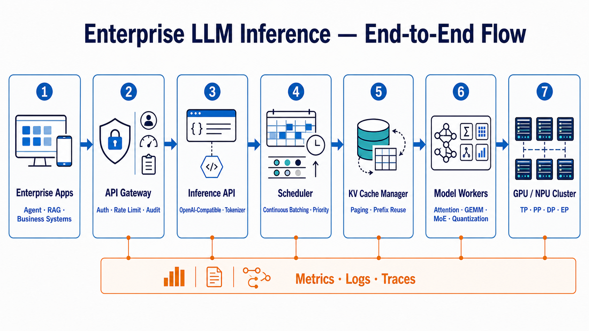
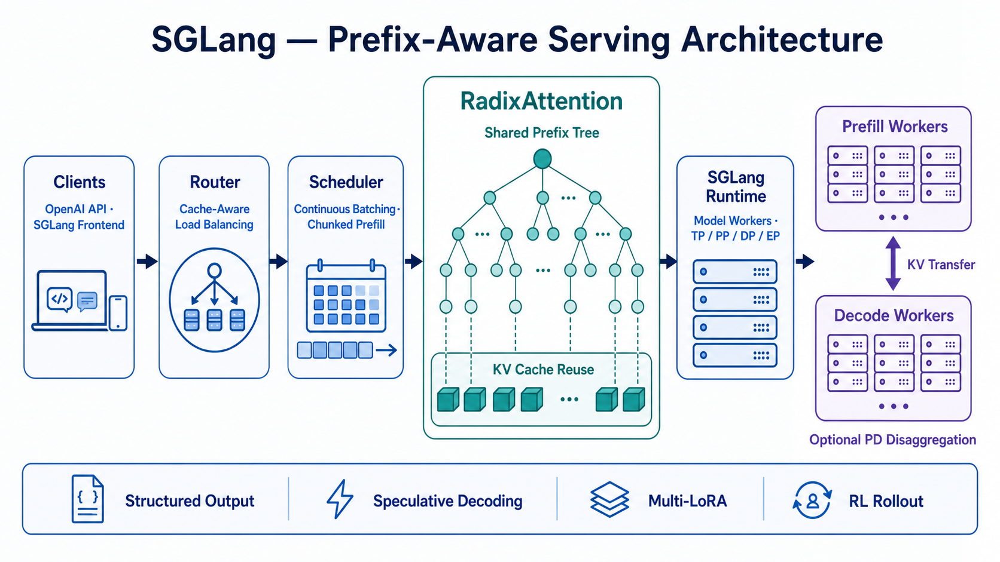
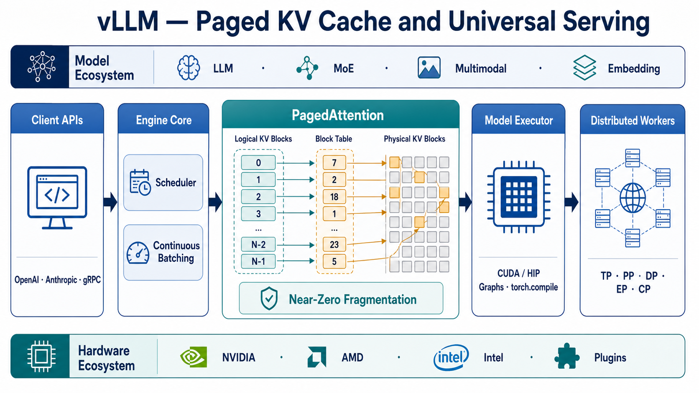
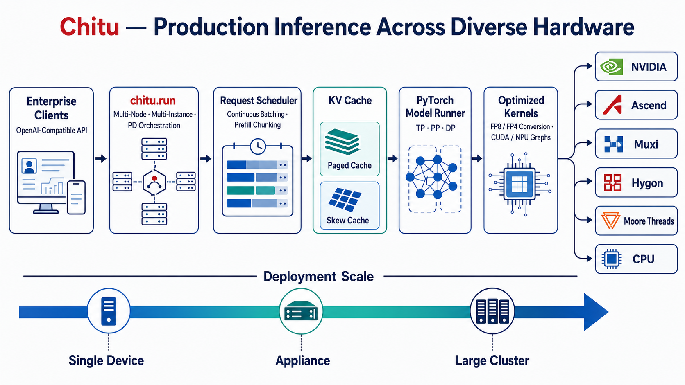

# Research: RadixArk、Inferact 与清程极智及其开源推理引擎

**日期**: 2026-08-04
**Owner**: nieyuanyuan
**状态**: Draft
**源项目 / 分支**: ai_infra_helper / main
**源 commit / 版本**: 调研时点 2026-08-04；SGLang、vLLM、Chitu 默认参考各自公开主分支与最新公开资料
**相关请求 / 问题**: 三家 AI Infra 公司的发展、融资、核心人员；SGLang、vLLM、赤兔 Chitu 的架构与特点；传统企业部署实施难度

## 修订记录

| 版本 | 日期 | 作者 | 摘要 |
|---|---|---|---|
| v0.1 | 2026-08-04 | nieyuanyuan | 初版调研，覆盖公司、产品架构、横向比较与企业部署。 |

## 1. 摘要

- 调研问题: RadixArk / SGLang、Inferact / vLLM、清程极智 / Chitu 分别处于什么发展阶段，产品技术路线有何差异，传统企业应如何选型和落地？
- 简短结论:
  - 三家公司都以开源推理引擎作为技术与生态入口，但商业化阶段和目标市场不同。RadixArk 与 Inferact 都在 2025 年成立，并在 2026 年以大额种子轮公开亮相；清程极智 2023 年底成立，融资节奏更早、更分散，重点服务中国本地尤其是国产算力场景。
  - vLLM 的最大优势是生态规模、模型覆盖、接口兼容和生产部署资料，适合作为传统企业的默认基线；SGLang 在共享前缀、复杂 Agent/RL 工作负载和大规模推理优化上更激进；Chitu 的差异化集中在国产芯片、旧卡、低精度转换和本地技术服务。
  - 单机 PoC 三者都不算困难；真正的难点是模型与硬件匹配、容量规划、GPU 集群网络、版本冻结、监控、安全和故障恢复。大规模 SGLang/vLLM 集群以及多种国产芯片上的 Chitu 都需要具备 CUDA/NPU、PyTorch、容器与 Kubernetes 经验的专项团队。
  - 不建议依据厂商单点性能数据直接排名。应在企业自己的模型、硬件、上下文长度和流量分布下，以 TTFT、TPOT、吞吐、成功率、显存占用、恢复时间和单位 Token 成本做同条件 PoC。
- 建议下一步: 选择一个实际模型和两类目标硬件，执行为期 2～4 周的同条件 PoC；把 vLLM 作为通用基线，将 SGLang 作为高复用 Agent/高性能候选，将 Chitu 作为国产算力候选。
- 置信度: Medium。开源产品部分为 High；公司融资金额与商业落地部分因私营公司披露有限为 Medium。

## 2. 范围

**范围内**:

- 截至 2026-08-04 的公司公开发展历程、融资历史与主要人员。
- SGLang、vLLM、Chitu 的开源架构、关键功能、生态和产品定位。
- 传统企业私有化部署的实施路径、组织要求、主要风险和相对难度。
- 基于公开资料的多维度比较和场景化选型建议。

**范围外**:

- 未对三款引擎执行同硬件、同模型的实测 Benchmark。
- 未审计商业版本的价格、SLA、闭源功能、合同条款和客户续费情况。
- 未验证所有厂商宣称的客户、GPU 数量、成本降幅和性能数字。
- 不覆盖训练框架的完整比较；RadixArk Miles 和清程极智“八卦炉”仅作为公司产品边界说明。

**假设**:

- “主力开源产品”分别指 SGLang、vLLM、Chitu，而不是三家公司的全部商业产品。
- “传统企业”指需要私有化或混合云、重视安全合规、变更流程和长期运维，且 AI Infra 团队规模有限的金融、制造、能源、运营商和政企客户。
- GitHub Star、贡献者数量和厂商自报部署规模只作为生态信号，不等价于质量或真实市场份额。

## 3. 调研方法

- 已查看的代码 / 文档:
  - 三个项目的 GitHub README、公开文档、论文、部署与可观测性说明。
  - RadixArk、Inferact、清程极智官网或公开发布资料。
  - 投资机构公告、公司融资新闻及对核心人员的公开采访。
- 使用的命令或查询:
  - 以公司名、项目名、founder、funding、architecture、deployment、Kubernetes、observability 等关键词进行公开网络检索。
  - 对融资、人员和产品能力尽量用两个来源交叉验证；优先采用官方、GitHub、论文和投资机构页面。
- 已检查的外部参考: 见第 9 节来源记录；正文关键事实也就近给出链接。
- 未验证的内容:
  - 私营公司的完整股权结构、累计到账资金、收入、客户合同和人员规模。
  - 三款产品在相同环境中的真实性能、稳定性和总拥有成本。
  - Chitu 缺少一份与 SGLang/vLLM 同粒度的公开总体架构文档，部分模块关系来自 README、配置项和仓库结构的归纳，属于分析性总结。

## 4. 调研内容

### 4.1 当前状态

#### 4.1.1 公司概览

| 公司 | 成立与公开发展 | 融资 | 核心人员 | 当前定位与边界 |
|---|---|---|---|---|
| RadixArk | SGLang 研究工作始于 2023 年；公司于 2025 年形成，2026-05-05 正式公开发布 | 2026-05 宣布 1 亿美元种子轮，投后估值 4 亿美元；Accel 领投、Spark Capital 联合领投，NVentures、AMD、MediaTek 等参投 | Ying Sheng：联合创始人、CEO；Banghua Zhu：联合创始人、CTO；团队由 SGLang 创建者和核心维护者组成 | 以 SGLang 推理和 Miles 强化学习/后训练为开源基础，向上提供托管基础设施与工具。公司口径见[发布公告](https://www.businesswire.com/news/home/20260505077157/en/RadixArk-Launches-with-%24100-Million-in-Seed-Funding-Led-by-Accel-to-Grow-SGLang-and-Democratize-Frontier-AI-Infrastructure)和[公司介绍](https://www.morningstar.com/news/business-wire/20260505077157/radixark-launches-with-100-million-in-seed-funding-led-by-accel-to-grow-sglang-and-democratize-frontier-ai-infrastructure)。 |
| Inferact | vLLM 于 2023 年在 UC Berkeley Sky Computing Lab 发布；Inferact 成立于 2025 年，2026-01-22 正式公开 | 2026-01 宣布 1.5 亿美元种子轮、估值 8 亿美元；a16z 与 Lightspeed 共同领投，Sequoia、Altimeter、Redpoint、真格等参投 | Simon Mo：联合创始人、CEO；Woosuk Kwon：联合创始人、CTO；Kaichao You：联合创始人、Chief Scientist；Roger Wang：联合创始人；Joseph Gonzalez、Ion Stoica 等为 founding members | 短期重点是持续投入 vLLM，长期建设“universal inference layer”和更易用的商业推理基础设施。[Inferact 官方](https://inferact.ai/)与[Lightspeed 公司页](https://lsvp.com/company/vllm-inferact/)给出了团队和融资信息。 |
| 清程极智 | 2023-12 由清华高性能计算背景团队成立；2025-03 与清华团队联合开源 Chitu；2025～2026 形成“八卦炉训练、赤兔推理、AI Ping 评测路由”产品矩阵 | 2024-03 天使轮数千万元；2025-01 新一轮融资，公开金额口径不完全一致；2025-07 再获过亿元融资。到 2026 年中公开报道为三轮融资，投资方包括中科创星、中金资本、中关村科学城、北京市人工智能产业投资基金、联想创投、奇绩创坛等，最新轮有清华大学资产管理公司战略入股 | 翟季冬：首席科学家；汤雄超：CEO；师天麾、唐适之：联合创始人 | 面向国产智能算力提供训练、推理、评测与路由软件，Chitu 强调国产芯片和从一体机到集群的部署。[中国科学报专访](https://news.sciencenet.cn/sbhtmlnews/2026/6/390074.shtm)提供了成立、人员、三轮融资和落地背景。 |

> 融资口径说明：RadixArk 和 Inferact 的金额来自公司/投资机构公开发布，可信度较高；清程极智各轮的轮次名称与金额在媒体间存在差异。可以确认的是 2024 年首轮、2025 年初第二轮、2025 年 7 月第三轮，以及后两轮“过亿元”的公开报道，但不宜据此精确计算累计融资。

#### 4.1.2 发展历程

**RadixArk / SGLang**

1. 2023-12：SGLang 论文发布，系统由前端语言与运行时组成，核心创新包括 RadixAttention 和压缩有限状态机；论文报告在复杂语言模型程序上相对当时系统取得最高 6.4 倍吞吐提升。[SGLang 论文](https://arxiv.org/abs/2312.07104)
2. 2024～2025：项目从结构化生成运行时扩展为完整的大模型/多模态 serving 框架，加入连续批处理、Paged Attention、量化、推测解码、PD 分离和多种并行方式。
3. 2025：团队形成商业主体并继续维护 SGLang；公开资料显示公司在正式发布前已运营一段时间。
4. 2026-05：RadixArk 以 1 亿美元种子轮公开亮相，并将 SGLang 推理、Miles 后训练和托管平台组合为端到端 AI Infra 方向。

**Inferact / vLLM**

1. 2023-06：vLLM 首次公开，核心是借鉴操作系统虚拟内存的 PagedAttention；2023-09 论文系统化描述其接近零浪费的 KV Cache 管理和跨请求共享。[PagedAttention 论文](https://arxiv.org/abs/2309.06180)
2. 2024～2025：vLLM 发展为跨模型、跨硬件的通用推理引擎，并形成开放治理、硬件厂商插件和 Production Stack。
3. 2025：Inferact 成立。Woosuk Kwon 的公开履历显示其 2025-11 起担任 Inferact 联合创始人兼 CTO。[个人主页](https://woosuk.me/)
4. 2026-01：Inferact 公布 1.5 亿美元种子轮。a16z 的投资公告表示公司的近期首要目标是给 vLLM 提供专职工程资源，随后再建设商业推理层。[a16z 投资公告](https://a16z.com/announcement/investing-in-inferact/)

**清程极智 / Chitu**

1. 2021 起：团队相关研究开始在国产超算上探索大规模模型训练，形成后来的“八卦炉”技术积累。
2. 2023-12：北京清程极智科技有限公司成立，切入国产算力系统软件。
3. 2024-03：完成首轮数千万元融资。
4. 2025-03-14：与清华大学团队联合开源 Chitu v0.1.0，首先解决 DeepSeek-R1 671B 与 FP8 转换问题。
5. 2025-04～08：快速加入 CPU+GPU 异构、FP4 转换、昇腾 910B、沐曦、海光等适配和一体机部署能力。
6. 2025-07：宣布新一轮过亿元融资。[经济观察网融资报道](https://www.eeo.com.cn/2025/0714/738420.shtml)
7. 2025-12～2026-07：重点增强集群场景；v0.6.0 发布 `chitu.run`，用单个可执行文件编排多节点、多实例和 PD 分离。[Chitu README](https://github.com/thu-pacman/chitu)

#### 4.1.3 开源项目当前规模与产品定位

以下数字为 2026-08-04 GitHub 页面快照，会持续变化：

| 项目 | 许可证 | GitHub 规模信号 | 官方定位 | 主要商业主体 |
|---|---|---|---|---|
| SGLang | Apache-2.0 | 约 31.2k Star、7.6k Fork | 高性能 LLM、多模态及 RL rollout serving；从单 GPU 到大规模集群 | RadixArk |
| vLLM | Apache-2.0 | 约 88.1k Star、20.2k Fork、官方称 2,000+ contributors | 易用、高吞吐、内存高效的通用 LLM 推理与服务引擎 | Inferact |
| Chitu | Apache-2.0（仓库还包含其他许可证第三方组件） | 约 3.2k Star、272 Fork | 面向效率、灵活性、可用性的生产级推理引擎，重点覆盖国产算力 | 清程极智与清华 PACMAN 团队 |

这些指标说明 vLLM 的全球通用生态明显最大，SGLang 已进入主流第一梯队，Chitu 仍较新但在中国国产硬件领域形成了鲜明差异化；Star 数不应作为性能结论。

### 4.2 关键链路 / 机制

#### 4.2.1 通用推理服务链路

三款引擎虽然实现不同，但生产链路可以抽象为：

```text
[企业应用 / Agent / RAG]
  -> [API Gateway：认证、限流、审计、路由]
  -> [OpenAI-compatible API / Tokenizer]
  -> [Scheduler：连续批处理、优先级、抢占]
  -> [KV Cache Manager：分页、前缀复用、换入换出]
  -> [Model Runner：Attention / GEMM / MoE / Quantization Kernels]
  -> [单卡或 TP / PP / DP / EP 多卡多节点 Worker]
  -> [流式 Token 返回 + Metrics / Logs / Traces]
```



*图 1：传统企业大模型推理服务的端到端通用链路（英文）。*

- 重要行为: Prefill 处理完整输入，计算密集；Decode 逐 Token 生成，显存带宽与 KV Cache 密集。连续批处理让新请求动态进入批次；KV Cache 管理直接影响并发、吞吐和显存利用率。
- 边界 / 归属: 三个开源项目解决“模型执行与 serving engine”，但企业仍需自行提供身份认证、TLS/WAF、模型仓库、发布系统、配额、审计、容灾和成本治理，除非采购厂商商业平台。
- 运行时或运维注意点: 驱动、CUDA/NPU SDK、PyTorch、通信库、量化格式、模型实现和引擎版本强耦合；不能把普通无状态 Web 服务的滚动升级经验原样套用到多卡模型服务。

#### 4.2.2 SGLang 架构与特点

```text
[OpenAI / Native API + SGLang Frontend]
  -> [Tokenizer / Router / Cache-aware Load Balancer]
  -> [Scheduler + Radix Tree Prefix Cache]
  -> [SGLang Runtime Workers]
  -> [Attention / MoE Kernels + TP/PP/DP/EP]
  -> [可选 Prefill-Decode 分离与跨节点 KV 传输]
```



*图 2：以 RadixAttention 前缀复用和可选 PD 分离为中心的 SGLang 架构（英文）。*

核心机制：

- **RadixAttention**：把请求前缀组织成 Radix Tree，自动复用跨请求的 KV Cache，特别适合多轮对话、few-shot、RAG 公共上下文和 Agent 工作流。
- **高性能调度**：连续批处理、分页注意力、chunked prefill、推测解码和 zero-overhead CPU scheduler 共同降低调度开销。
- **复杂输出与 Agent 支持**：结构化输出、工具调用、多 LoRA、推理解析器和多模态；历史上 SGLang 前端语言也是其区别于纯 serving engine 的来源。
- **大模型分布式能力**：支持 TP、PP、DP、EP，以及 Prefill/Decode 分离。官方 PD 文档明确区分 Prefill 的计算密集与 Decode 的内存密集，并支持 Mooncake、NIXL 等 KV 传输后端。[SGLang PD 文档](https://docs.sglang.ai/backend/pd_disaggregation.html)
- **RL / 后训练连接**：SGLang 被 Miles、slime、verl 等框架作为 rollout backend 使用，是 RadixArk 从推理扩展到后训练的技术支点。
- **可观测性**：可开启 Prometheus metrics；默认不记录请求内容，另有请求 dump/replay 与 crash dump，便于性能复现和故障诊断。[SGLang 可观测性](https://docs.sglang.ai/advanced_features/observability.html)

产品特点：技术演进快、针对新模型和新硬件做 day-0 优化，适合共享前缀比例高、Agent/RL、DeepSeek/MoE 和大规模集群场景；代价是高级参数多、版本变化快，大规模部署需要较强性能工程能力。

#### 4.2.3 vLLM 架构与特点

```text
[OpenAI / Anthropic Messages / gRPC API]
  -> [Engine Core + Scheduler]
  -> [Paged KV Block Manager / Prefix Cache]
  -> [Model Executor]
  -> [Attention / GEMM / MoE Kernels]
  -> [TP/PP/DP/EP/CP Workers + 多硬件插件]
```



*图 3：以 PagedAttention 逻辑块到物理块映射为中心的 vLLM 架构（英文）。*

核心机制：

- **PagedAttention**：将每个请求的 KV Cache 划分成块，逻辑块可映射到非连续物理块，类似操作系统分页，从而减少碎片和预留浪费，并支持请求内、请求间共享。
- **通用调度与执行**：连续批处理、chunked prefill、prefix caching、CUDA/HIP Graph、`torch.compile`、多种推测解码和量化格式。
- **广泛接口与模型覆盖**：OpenAI-compatible API、Anthropic Messages API、gRPC；覆盖 decoder-only、MoE、多模态、embedding、reward/classification 等模型。当前 README 称支持 200+ Hugging Face 模型架构；Inferact 官网使用了 500+ 模型架构、200+ accelerator types 的更宽口径，两者统计口径不同，不应直接混用。
- **分布式与异构硬件**：TP、PP、DP、EP、CP；NVIDIA、AMD、Intel GPU 和多种 CPU 为主线，同时通过插件支持 TPU、Gaudi、Ascend、MetaX 等。[vLLM README](https://github.com/vllm-project/vllm)
- **生产生态**：官方 Production Stack 提供 Kubernetes CRD、路由、服务发现、容错和生命周期管理；文档将 CRD 方式推荐给生产环境。[vLLM Production Stack](https://docs.vllm.ai/projects/production-stack/en/latest/deployment/crd.html)

产品特点：最大优势是生态广度、标准 API、模型/硬件覆盖、社区与部署资料。对于普通企业，它通常是风险最低的开源基线；但其能力面很宽，版本、插件和硬件组合也多，生产稳定并不等于“pip install 后直接上线”。

#### 4.2.4 Chitu 架构与特点

基于公开仓库结构、启动配置和 README，可归纳为：

```text
[OpenAI-compatible Service / chitu.run]
  -> [多节点、多实例编排与请求调度]
  -> [Paged / Skew KV Cache + Prefill Chunking]
  -> [PyTorch Model Runner]
  -> [自研 C++/CUDA/NPU 算子、FlashAttention/FlashInfer 等组件]
  -> [TP/PP/DP + 可选 PD 分离]
  -> [NVIDIA / Ascend / Muxi / Hygon / Moore Threads / CPU]
```



*图 4：突出多元硬件适配与渐进部署规模的 Chitu 架构（英文）。*

核心机制：

- **国产硬件优先**：项目仓库提供 NVIDIA、昇腾、沐曦、海光等独立构建入口，并在 v0.5.1 加入摩尔线程支持；重点不是仅做到“能运行”，而是针对数据格式、算子、通信与芯片特性优化。
- **低精度与有限资源部署**：提供 FP8 在线转 BF16、FP4 在线转 FP8/BF16、Paged/Skew KV Cache、CUDA/NPU Graph，以及 CPU+GPU 异构混合推理。其典型目标是让不原生支持特定低精度的国产芯片或旧卡部署 DeepSeek 等模型。
- **渐进式伸缩**：官方定位从纯 CPU、单 GPU、一体机到大规模集群；v0.6.0 的 `chitu.run` 统一多节点、多实例和 PD 分离启动入口。
- **面向中国企业的交付**：中文文档、国内镜像、国产硬件版本和厂商技术服务更贴近本地私有化环境；官方同时提醒开源团队无法保证及时解决所有问题，生产用户可能需要商业支持。
- **公开架构透明度仍在补齐**：目前公开 README 对能力和里程碑较清晰，但缺少与 vLLM Engine Core 或 SGLang Runtime 同粒度、稳定维护的总体架构说明。这会增加企业二次开发、故障归因和人才招聘成本。

产品特点：在国产算力、旧卡、DeepSeek 大模型和本地交付上差异明显；全球模型生态、贡献者规模、标准化生产工具链和英文资料弱于 vLLM/SGLang。官方披露的券商、能源企业案例可作为落地信号，但仍需客户侧验收。[清程极智/Chitu 产品页](https://www.qc-ai.cn/products/chitu)

### 4.3 关键发现

#### Finding 1: 三家公司本质上是“开源引擎 + 商业化运维复杂度”的相似模式，但市场楔子不同

- 证据:
  - RadixArk 建立在 SGLang 与 Miles 之上，向训练、后训练、推理一体化扩展。
  - Inferact 近期明确优先投入 vLLM，并把长期商业目标定义为 universal inference layer。
  - 清程极智同时覆盖训练、推理和 API 评测路由，Chitu 以国产算力适配进入企业。
- 为什么重要: 采购开源引擎不等于采购完整企业平台。企业必须判断未来是自建控制面，还是购买厂商托管、交付、SLA 和硬件优化服务。
- 置信度: High。

#### Finding 2: vLLM 是通用默认基线，SGLang 与 Chitu 分别在“前沿性能/Agent”和“国产算力”形成更强场景优势

- 证据:
  - vLLM 的 GitHub 规模、贡献者、模型与 API 覆盖、Production Stack 均领先。
  - SGLang 的 RadixAttention、PD 分离、RL rollout 和大规模 MoE 优化形成技术差异。
  - Chitu 从发布起持续围绕昇腾、沐曦、海光、摩尔线程和低精度转换迭代。
- 为什么重要: 对普通 NVIDIA/Hugging Face 场景，vLLM 能降低组织学习成本；共享前缀和 Agent/RL 场景应认真测试 SGLang；信创/国产芯片场景不应只用海外项目的“插件支持”推断生产成熟度，Chitu 值得进入 PoC。
- 置信度: High（方向判断）；具体性能优势为 Medium，必须实测。

#### Finding 3: 传统企业部署的主要难度不在启动命令，而在生产控制面和持续性能工程

- 证据:
  - vLLM 已提供 Kubernetes Production Stack，SGLang 提供 Prometheus、dump/replay、PD 分离等能力，但身份治理、审计、灰度、模型供应链和成本治理仍需外围系统。
  - Chitu 社区实测显示同一引擎在不同显卡、显存、驱动和 `max_seq_len` 参数下表现差异很大，显存配置不当会直接 OOM。[Chitu 用户实测](https://github.com/thu-pacman/chitu/discussions/104)
- 为什么重要: 企业若只安排应用开发人员，会低估 GPU 驱动、NCCL/HCCL、拓扑、KV Cache、量化精度、负载建模和故障恢复的工作量。
- 置信度: High。

#### 4.3.1 多维度汇总比较

| 维度 | SGLang | vLLM | Chitu |
|---|---|---|---|
| 核心技术标签 | RadixAttention、共享前缀、结构化生成、PD 分离、RL rollout | PagedAttention、通用 Engine Core、广泛模型/硬件/API | 国产芯片适配、低精度转换、CPU+GPU 异构、一体机到集群 |
| 最强场景 | 多轮对话、RAG 公共前缀、Agent、RL、前沿 MoE/大规模集群 | 通用 Hugging Face 模型服务、标准 OpenAI API、跨团队平台化 | 国产算力、旧卡、DeepSeek 私有化、本地交付与信创要求 |
| 模型生态 | 广，主流 LLM/VLM/embedding/reward/diffusion | 最广，200+ README 口径模型架构，社区集成多 | 聚焦 DeepSeek、Qwen、GLM、Kimi 等国内主流模型，覆盖面较窄 |
| 硬件策略 | NVIDIA/AMD 为强项，并扩展 TPU、Ascend、CPU | NVIDIA/AMD/Intel/CPU 主线，其他硬件多通过插件 | 国产 NPU/GPU 与 NVIDIA 并重，强调芯片专项优化 |
| 分布式能力 | TP/PP/DP/EP、PD 分离、KV 传输，前沿但复杂 | TP/PP/DP/EP/CP、PD 分离，工具链完整 | TP/PP/DP、PD 分离；集群能力快速增强，公开生态较新 |
| API 与应用兼容 | OpenAI-compatible + 原生接口 + SGLang 前端 | OpenAI、Anthropic Messages、gRPC，兼容面最广 | 提供服务接口并面向企业部署；公开 API 生态资料较少 |
| 可观测与生产工具 | Prometheus、日志、request/crash dump/replay；高级集群需自行集成 | Metrics、Grafana 示例、Production Stack、K8s/CRD，最成熟 | 基准与社区测试活跃；标准化 K8s、监控和控制面资料相对不足 |
| 社区成熟度 | 第一梯队，更新快，约 31.2k Star | 最大，约 88.1k Star、2,000+ contributors | 较新，约 3.2k Star，本地硬件合作方较强 |
| 商业支持方向 | RadixArk 托管推理 + 后训练/训练基础设施 | Inferact 维护 vLLM + 商业 universal inference layer | 清程极智私有化交付、国产算力优化和全栈产品 |
| 开源 PoC 难度 | 低～中 | 低 | 中；不同国产硬件依赖对应 SDK/镜像 |
| 生产部署难度 | 中～高；高级性能特性参数较多 | 中；Production Stack 降低平台工程量 | NVIDIA 场景中，国产芯片场景中～高；商业服务可显著降低难度 |
| 主要风险 | 快速演进、参数复杂、性能结论对负载敏感 | 版本/插件组合多，通用能力不保证每个组合最优 | 社区与文档规模较小、硬件矩阵碎片化、关键问题可能依赖厂商支持 |

> 性能比较原则：不列“谁比谁快 X%”。公开测试往往使用不同版本、模型、精度、GPU、输入输出长度和并发。只有同环境 A/B 才能形成采购结论。

#### 4.3.2 传统企业部署实施分析

**推荐实施架构**

```text
[内网业务 / RAG / Agent]
  -> [企业 API Gateway：SSO/mTLS、RBAC、配额、审计、内容策略]
  -> [模型路由层：版本、灰度、负载与回退]
  -> [SGLang / vLLM / Chitu Serving Pool]
       -> [本地模型仓库 / 对象存储 / 只读缓存]
       -> [GPU/NPU 节点池 + 高速互联]
  -> [Prometheus/Grafana + Logs/Traces + GPU/NPU Telemetry]
  -> [离线 Benchmark、回归评测与容量规划流水线]
```

**分阶段路径**

| 阶段 | 典型周期 | 工作 | 退出标准 |
|---|---|---|---|
| 0. 需求冻结 | 1 周 | 明确模型、精度、上下文、峰均 QPS、SLO、硬件、合规和预算 | 有可执行的流量模型与验收阈值，而不是“越快越好” |
| 1. 单节点 PoC | 1～2 周 | 固定版本，启动 OpenAI-compatible API，验证正确性、显存和基础吞吐 | 真实样本精度一致；无 OOM；得到 TTFT/TPOT/吞吐基线 |
| 2. 多卡与容量 | 1～3 周 | TP/PP/DP/EP、量化、批处理、前缀缓存、故障注入 | 峰值负载满足 SLO；性能可复现；有容量公式 |
| 3. 生产平台 | 2～6 周 | 容器镜像、K8s/裸机编排、模型仓库、网关、监控、灰度、回滚 | 可自动部署、扩缩、告警、审计和回滚 |
| 4. 稳定运营 | 持续 | 版本冻结与升级认证、成本优化、模型更新、事故演练 | 有版本矩阵、值班 Runbook、月度成本/SLO 报告 |

**三者实施差异**

- **vLLM**
  - 最容易找到熟悉的工程师、案例、镜像和第三方集成；OpenAI API 迁移成本通常最低。
  - Kubernetes Production Stack 能减少路由、服务发现和生命周期管理的自研量，适合已有云原生平台的企业。
  - 难点仍是 GPU 拓扑、共享内存、模型分片、插件版本和容量调优。使用国产芯片时必须验证对应插件是否覆盖目标模型、量化和监控，不应只看“支持列表”。
  - 难度判断：PoC **低**；标准 NVIDIA 生产 **中**；多节点/异构 **中高**。

- **SGLang**
  - 单机 API 启动接近 vLLM，但要兑现 RadixAttention、cache-aware routing、PD 分离和大规模 EP 的优势，需要更精细的流量建模和网络设计。
  - 对大量共享 System Prompt、RAG 模板、多轮 Agent 和 RL rollout，优化收益可能很高；对短请求或低并发业务，复杂度未必值得。
  - Prometheus 和 dump/replay 有利于生产排障，但高级部署需要团队理解 KV Cache 生命周期、Mooncake/NIXL、RDMA 和 Prefill/Decode 容量比。
  - 难度判断：PoC **低～中**；标准 NVIDIA 生产 **中**；PD/大规模 MoE **高**。

- **Chitu**
  - 对国产算力，官方镜像、硬件专项算子和本地服务可能比通用引擎插件更接近“可交付”；对信创、数据不出域和旧卡复用有现实价值。
  - 难点是芯片 SDK、驱动、PyTorch 分支、通信库和引擎版本组合碎片化。每种芯片/模型/精度都应单独建立认证矩阵。
  - `chitu.run` 降低了多节点启动复杂度，但企业级 K8s Operator、路由、可观测、自动扩缩和故障恢复仍需自行验证或依赖清程极智商业交付。
  - 难度判断：NVIDIA PoC/生产 **中**；有厂商支持的国产算力 **中**；纯开源自建国产集群 **高**。

**人员与能力要求**

一个可持续的生产团队至少需要：

- 1 名推理性能工程师：模型结构、量化、KV Cache、Attention/MoE kernel、Benchmark。
- 1～2 名平台/SRE：容器、Kubernetes 或裸机调度、GPU/NPU 监控、发布、容灾。
- 1 名应用/评测工程师：OpenAI API、RAG/Agent、数据集、质量和回归评测。
- 安全与合规兼职支持：模型/镜像供应链、访问控制、审计、敏感数据和许可证。
- 国产芯片场景通常还需要芯片厂商或 Chitu 团队的联合支持窗口。

### 4.4 GAP 和风险

| GAP / 风险 | 影响 | 证据 | 严重程度 |
|---|---|---|---|
| 缺少同条件实测 | 无法证明任一引擎在目标业务上更快或更省 | 公开 Benchmark 环境不可直接比较 | High |
| 融资与商业数据不完整 | 无法准确评估公司 runway、收入和持续服务能力 | 三家公司均为私营公司；清程极智部分轮次金额口径不一 | Medium |
| 开源与商业产品边界变化 | 今天免费的控制面或支持未来可能商业化，影响 TCO | 三家公司都在开源引擎之上建设商业层 | Medium |
| 快速版本迭代 | 新模型 day-0 支持与生产稳定性可能冲突 | 三个项目 2025～2026 均高频发布 | High |
| 模型/硬件/精度矩阵爆炸 | “支持某硬件”不等于目标组合已生产验证 | vLLM 插件生态、SGLang 多后端、Chitu 多国产 SDK | High |
| 安全控制不完整 | 直接暴露引擎 API 可能缺少企业身份、审计和内容治理 | 开源引擎核心边界是 serving，不是完整企业网关 | High |
| 供应链与许可证 | 模型权重、第三方算子、容器和子模块许可证可能限制商用 | 三者主许可证为 Apache-2.0，但模型与第三方组件需另审 | Medium |
| 人才与厂商锁定 | 深度依赖特定引擎参数或国产芯片分支，迁移成本增加 | 高性能配置与硬件耦合 | Medium |
| 厂商自报规模未经独立审计 | 可能高估市场采用和稳定性 | 400k+ GPU、成本降幅等主要来自项目/投资方口径 | Medium |

## 5. 可选方向

| 方案 | 描述 | 适合场景 | 成本 / 风险 | 建议 |
|---|---|---|---|---|
| A | vLLM 作为统一企业推理基线 | NVIDIA 为主、Hugging Face 模型多、团队希望最小化生态风险 | 极致性能未必优于专项引擎；国产插件需逐项验证 | **默认推荐**。最适合作为所有候选的基线 |
| B | SGLang 作为高性能/Agent 专项引擎 | 大量共享前缀、长上下文、多轮 Agent、RL rollout、DeepSeek/MoE、大规模集群 | 高级特性带来调度、网络和运维复杂度 | **场景推荐**。PoC 证明收益超过复杂度后采用 |
| C | Chitu 作为国产算力与本地交付引擎 | 昇腾/沐曦/海光/摩尔线程、信创、旧卡复用、中文现场支持 | 社区和生产工具链较新；组合碎片化；可能依赖商业支持 | **国产场景优先进入 PoC**，并要求厂商对目标组合给出支持矩阵和 SLA |
| D | 双引擎平台：vLLM 基线 + SGLang 或 Chitu 专项池 | 企业有多类硬件或工作负载，并具备平台团队 | 运维矩阵、回归测试和路由复杂度翻倍 | 仅在单引擎明确无法同时满足需求时采用 |

## 6. 建议

**建议方向**:

采用“一个通用基线 + 一个专项候选”的 PoC，而不是一开始建设三引擎生产平台：

1. NVIDIA 通用场景：vLLM 为基线，SGLang 为性能候选。
2. 国产算力场景：Chitu 为专项候选，同时选择目标芯片上可运行的 vLLM/SGLang 版本作为对照。
3. 以企业真实流量回放进行比较，至少覆盖短输入长输出、长输入短输出、共享前缀 Agent/RAG、峰值突发和节点故障。
4. 商业评估要求三家公司分别提供：支持版本矩阵、响应 SLA、升级策略、重大故障案例、客户参考、价格和退出/迁移方案。

**原因**:

- vLLM 能提供最大生态与最低起步风险，但不能代表每个前沿负载或国产硬件的最优结果。
- SGLang 的技术优势依赖工作负载特征，必须用共享前缀命中率和 PD 资源比来证明。
- Chitu 的国产适配价值与企业硬件采购高度相关，商业支持质量可能比 GitHub 指标更重要。
- 双候选 PoC 可以控制试验成本，同时保留证据驱动的选择空间。

**应该进入设计文档的内容**:

- 企业目标模型、硬件、精度、上下文和流量分布。
- 推理服务控制面：网关、路由、模型仓库、发布、监控、审计和回滚。
- 单/多节点拓扑、并行策略、容量模型和 SLO。
- 版本与镜像供应链、离线环境、漏洞与许可证治理。
- PoC 测试矩阵、验收阈值、商业支持和退出策略。

**不应该进入设计文档的内容**:

- 未经同条件复现的厂商性能倍数。
- 把 GitHub Star 或融资额当作技术选型权重的简单打分。
- 在尚未确定目标芯片和模型前锁定高级 PD/EP 拓扑。
- 未经安全评审就直接暴露引擎原生 API。

## 7. 验证要求

后续 PoC / 设计必须包含：

- 单元 / 组件:
  - OpenAI-compatible API、流式输出、工具调用、结构化输出、停止条件和错误码兼容性。
  - 目标模型在 BF16/FP8/FP4/INT8 等候选精度下的质量回归。
  - 镜像、模型权重、驱动和依赖的 checksum 与 SBOM。
- 集成 / workflow:
  - API Gateway 认证、限流、租户配额、审计和超时重试。
  - 模型下载/离线导入、版本升级、灰度、回滚和冷启动。
  - Prometheus/Grafana、GPU/NPU telemetry、日志脱敏和 trace 关联。
- 端到端 / 运维:
  - 真实 RAG/Agent 流量回放；P50/P95/P99 TTFT、TPOT、E2E latency、吞吐和成功率。
  - 单进程、单卡、单节点、多节点故障；网络抖动、磁盘慢、模型加载失败和 worker OOM。
  - 24～72 小时 soak test、峰值突发和容量降级。
- 回归:
  - 每次引擎、驱动、模型和量化版本变化都重跑固定测试集。
  - 比较输出质量、显存、功耗、单位 Token 成本和恢复时间，不只看 tok/s。
- 负向 / 失败场景:
  - 超长输入、恶意并发、无效参数、取消请求、客户端断连和流式中断。
  - 节点丢失、NCCL/HCCL 超时、KV Cache 压力、路由到错误模型、灰度版本不兼容。
  - 未授权访问、敏感 Prompt 日志、模型供应链污染和容器逃逸面。

## 8. Open Questions

- [ ] 企业实际目标硬件是 NVIDIA、AMD、昇腾还是其他国产芯片？是否已有采购锁定？
- [ ] 首批目标模型、上下文长度、量化精度和峰值并发分别是什么？
- [ ] 工作负载中共享 System Prompt / RAG 前缀的比例是多少？这决定 RadixAttention 的实际价值。
- [ ] 是否必须支持多模态、embedding、reranker、LoRA、结构化输出和工具调用？
- [ ] 企业是否已有 Kubernetes GPU 平台，还是更适合裸机/一体机交付？
- [ ] 对离线环境、国产化率、等保/密评、数据驻留和审计有哪些硬约束？
- [ ] RadixArk 与 Inferact 的商业产品当前具体提供哪些 on-prem 功能与 SLA？
- [ ] 清程极智各目标芯片版本的支持矩阵、升级承诺、客户可验证案例和商业报价是什么？
- [ ] 是否接受双引擎长期运维，还是必须收敛为单引擎？

## 9. 来源记录

| 来源 | 日期 / 版本 | 备注 |
|---|---|---|
| [RadixArk 正式发布与融资公告](https://www.businesswire.com/news/home/20260505077157/en/RadixArk-Launches-with-%24100-Million-in-Seed-Funding-Led-by-Accel-to-Grow-SGLang-and-Democratize-Frontier-AI-Infrastructure) | 2026-05-05 | 1 亿美元种子轮、4 亿美元投后估值、投资方与公司定位；公司发布口径 |
| [RadixArk 公告镜像与创始人信息](https://www.morningstar.com/news/business-wire/20260505077157/radixark-launches-with-100-million-seed-funding-led-by-accel-to-grow-sglang-and-democratize-frontier-ai-infrastructure) | 2026-05-05 | Ying Sheng、Banghua Zhu 与产品边界 |
| [Banghua Zhu 个人主页](https://banghua.me/) | 访问于 2026-08-04 | CTO / 联合创始人与团队背景 |
| [SGLang GitHub](https://github.com/sgl-project/sglang) | 访问于 2026-08-04 | 功能、硬件、采用、许可证与 GitHub 指标 |
| [SGLang 论文](https://arxiv.org/abs/2312.07104) | 2023-12，后续有修订 | 前端/运行时、RadixAttention、结构化输出与论文实验 |
| [SGLang PD Disaggregation](https://docs.sglang.ai/backend/pd_disaggregation.html) | 访问于 2026-08-04 | Prefill/Decode 特性与部署后端 |
| [SGLang Observability](https://docs.sglang.ai/advanced_features/observability.html) | 访问于 2026-08-04 | Prometheus、日志与 dump/replay |
| [Inferact 官方网站](https://inferact.ai/) | 2026-01 / 访问于 2026-08-04 | 创始成员、融资、使命与开源承诺 |
| [Lightspeed 的 Inferact 公司页](https://lsvp.com/company/vllm-inferact/) | 2026 | 成立时间、创始人及角色 |
| [a16z 投资 Inferact 公告](https://a16z.com/announcement/investing-in-inferact/) | 2026-01-22 | 公司战略、vLLM 生态和投资背景；投资方口径 |
| [Woosuk Kwon 个人主页](https://woosuk.me/) | 访问于 2026-08-04 | Inferact CTO 与 vLLM 共创者履历 |
| [vLLM GitHub](https://github.com/vllm-project/vllm) | 访问于 2026-08-04 | 架构能力、接口、硬件、模型、许可证与 GitHub 指标 |
| [PagedAttention / vLLM 论文](https://arxiv.org/abs/2309.06180) | 2023-09 | KV Cache 分页机制与原始实验 |
| [vLLM Production Stack CRD](https://docs.vllm.ai/projects/production-stack/en/latest/deployment/crd.html) | 访问于 2026-08-04 | Kubernetes 生产部署能力 |
| [清程极智官网 About](https://www.qc-ai.cn/about) | 访问于 2026-08-04 | 公司产品矩阵与定位；公司口径 |
| [清程极智 Chitu 产品页](https://www.qc-ai.cn/products/chitu) | 访问于 2026-08-04 | Chitu 企业定位与开源入口 |
| [中国科学报：清程极智团队专访](https://news.sciencenet.cn/sbhtmlnews/2026/6/390074.shtm) | 2026-06-15 | 成立、人员、融资、技术与客户案例；媒体采访 |
| [经济观察网：清程极智 2025-07 融资](https://www.eeo.com.cn/2025/0714/738420.shtml) | 2025-07-14 | 过亿元融资与投资方 |
| [Chitu GitHub](https://github.com/thu-pacman/chitu) | 访问于 2026-08-04 | 版本里程碑、功能、硬件、许可证与 GitHub 指标 |
| [Chitu 用户实测讨论](https://github.com/thu-pacman/chitu/discussions/104) | 2025-08 起持续更新 | 多硬件配置、部署命令和参数敏感性；社区自报数据，非统一 Benchmark |

## 10. 结论

- 是否进入设计: Yes。若目标是实际采购或部署，应进入“企业大模型推理平台 PoC 与生产化设计”。
- 要创建的设计文档: `YYYY-MM-DD-enterprise-llm-inference-platform-poc-design-zh.md`，输入必须包括目标模型、硬件、流量和合规约束。
- 实现前还需要补充的调研:
  - 对三家商业版进行 RFI/RFP，补齐 on-prem 功能、报价、SLA、升级策略和客户参考。
  - 在目标硬件执行同版本、同模型、同精度、同负载的 SGLang/vLLM/Chitu A/B/C Benchmark。
  - 审计目标模型、量化权重、容器和第三方算子的许可证及供应链。
  - 根据真实共享前缀比例验证 SGLang RadixAttention 收益，根据目标国产芯片验证 Chitu 专项优化和故障恢复。
