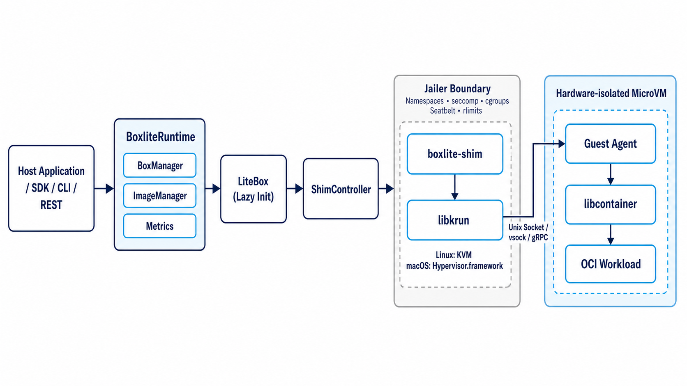
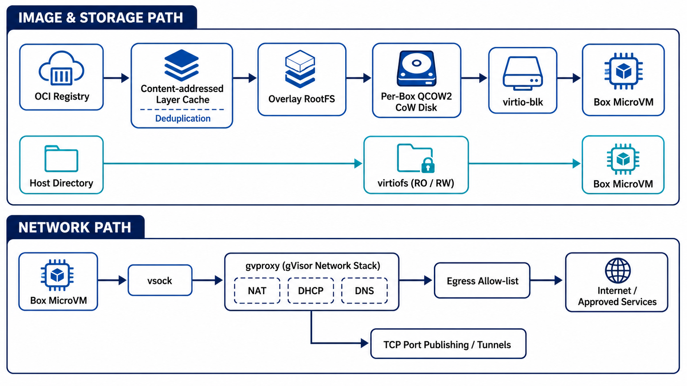
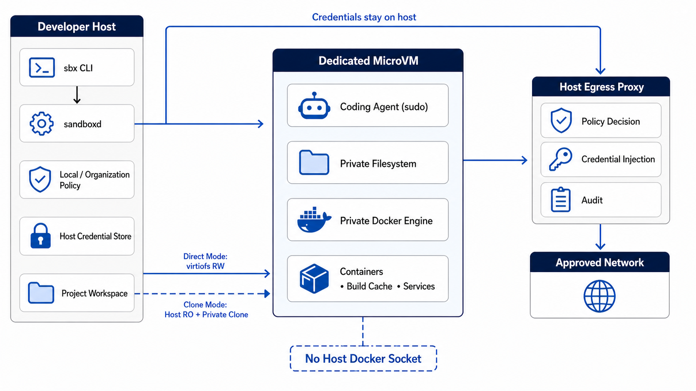
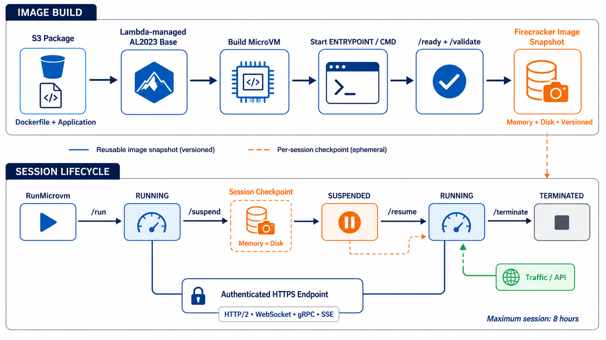
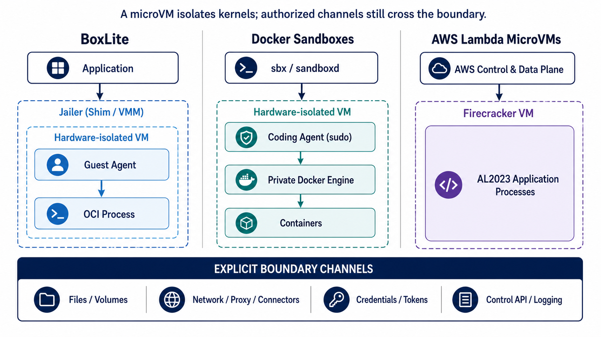

# Research: BoxLite、Docker Sandboxes 与 AWS Lambda MicroVMs 对比调研

**日期**: 2026-08-11
**Owner**: AI Infrastructure
**状态**: Draft
**源项目 / 分支**: `ai_infra_helper` / `main`
**源 commit / 版本**: BoxLite v0.9.7；Docker Sandboxes v0.38.0；AWS Lambda MicroVMs（2026-06-22 GA 首发资料）
**相关请求 / 问题**: 从发展历史、架构、关键技术和未来发展方向比较三种 microVM 产品，并评估其适用边界。

## 修订记录

| 版本 | 日期 | 作者 | 摘要 |
|---|---|---|---|
| v0.2 | 2026-08-11 | Codex | 为 4.2.1～4.2.5 补充 5 张英文架构与机制说明图。 |
| v0.1 | 2026-08-11 | Codex | 初版调研：汇总三条产品时间线、架构机制、能力差异、风险与选型建议。 |

## 1. 摘要

- 调研问题: BoxLite、Docker Sandboxes、AWS Lambda MicroVMs 是否是可直接横向替换的三种 microVM，技术和产品差异在哪里，分别适合什么场景？
- 简短结论: 三者共享“每个工作负载独立内核/硬件虚拟化边界”的理念，但不是同一层产品。BoxLite 是 Apache-2.0 的可嵌入、自托管运行时；Docker Sandboxes 是围绕本地编码智能体和 Docker-in-microVM 优化的开发者产品；Lambda MicroVMs 是基于 Firecracker 快照、由 AWS 全托管的有状态 serverless 原语。因此，选型首先取决于控制面归属和部署位置，而不是单看 microVM 启动速度。
- 建议下一步: 先以相同的编码智能体任务做 1～2 周 PoC，测量首次/热启动、构建吞吐、工作区 I/O、网络策略、凭据暴露、故障恢复和单位会话成本；生产托管场景优先验证 Lambda MicroVMs，本地开发优先验证 Docker Sandboxes，需要嵌入产品、自托管或跨云时优先验证 BoxLite。
- 置信度: Medium。核心机制和公开能力来自官方资料，可信度较高；三者缺少统一条件下的第三方基准，Docker 底层 VMM 细节及各产品未来路线也没有完全公开。

## 2. 范围

**范围内**:

- 截至 2026-08-11 的公开产品历史、稳定版本和官方定位。
- microVM 创建、执行、存储、网络、生命周期、安全边界与控制面架构。
- OCI/Docker 工作负载兼容性、持久状态、凭据处理、可观测性、部署与运维模型。
- 面向编码智能体、多租户代码执行和企业平台建设的适用性与未来发展判断。

**范围外**:

- 未执行真实安装、渗透测试、故障注入或统一硬件性能基准。
- 不评价厂商财务状况，也不把 GitHub star 数等同于生产成熟度。
- 不覆盖 Kata Containers、Cloud Hypervisor、gVisor、E2B 等其他沙箱方案。
- 不对 AWS 各区域价格做完整 TCO 报价；价格会随区域和时间变化。

**假设**:

- 目标工作负载是由用户或 AI 生成、需要较强隔离且持续数秒至数小时的 Linux 代码执行。
- “microVM”指用硬件虚拟化提供独立 guest kernel、又针对高密度和快速生命周期裁剪的虚拟机；产品层功能不因此自动等价。
- 文中“官方宣称”表示尚未在本调研中独立复测；“判断/推断”表示基于现有证据的分析，而非厂商承诺。

## 3. 调研方法

- 已查看的代码 / 文档: BoxLite README、公开架构文档、release 元数据与文档站；Docker 产品页、架构、安全模型、release notes 与官方博客；AWS Lambda MicroVMs 发布公告、开发者指南、网络、生命周期、配额、定价和 Firecracker 历史资料。
- 使用的命令或查询: 官方站点定向网页搜索；GitHub API 查询仓库与稳定 release 日期；仓库结构检查。
- 已检查的外部参考: 以项目仓库、厂商文档和厂商工程博客等一手资料为主。网页和仓库数据检查于 2026-08-11；动态指标仅作为当日快照。
- 未验证的内容: 厂商的“near-instant”“seconds”等性能表述；实际 CVE 响应、逃逸防护、噪声邻居影响、可用性 SLA；Docker 使用的具体 VMM/guest 组件；BoxLite 分布式控制面的生产规模；Lambda MicroVMs 的跨区域扩展时间表。

## 4. 调研内容

### 4.1 当前状态

#### 4.1.1 三者不是同一产品层

| 产品 | 产品层 / 主要入口 | 主要运行位置 | 核心用户 | 开放程度 | 当前公开状态 |
|---|---|---|---|---|---|
| BoxLite | 嵌入式库、CLI、可选 REST 服务、自托管控制面 | macOS Apple Silicon、Linux x86_64/ARM64、WSL2；可自建 AWS 控制面 | 构建智能体平台、桌面 AI、私有云的开发者 | 核心仓库 Apache-2.0，架构和实现可审计 | GitHub 仓库 2025-12 创建；2026-07-01 发布 v0.9.7；2026-08-11 快照约 2.2k stars、157 forks |
| Docker Sandboxes | `sbx` CLI/daemon、智能体适配、kit、策略与组织治理 | 开发者本机的 microVM（macOS、Windows 11、Linux） | 使用 Claude Code、Codex 等编码智能体的个人和团队 | 发布二进制与文档公开，但核心实现和 VMM 细节未见完整开源说明 | 2025-11 容器式实验预览；2026-01 macOS/Windows microVM；2026-08-06 v0.38.0 |
| AWS Lambda MicroVMs | AWS API/CLI/SDK、CloudFormation、CDK、独立 HTTPS endpoint | AWS 托管 Firecracker 基础设施 | SaaS、多租户代码执行、AI 沙箱、扫描/分析平台 | Firecracker 开源；Lambda MicroVMs 服务本身闭源 | 2026-06-22 发布；首发 5 个区域；最长会话 8 小时 |

这一区分决定了比较口径：BoxLite 更像“可以放进产品里的 SQLite 式 VM runtime”，Docker Sandboxes 更像“有安全护栏的本地智能体工作站”，Lambda MicroVMs 更像“按 API 创建的远程会话计算资源”。

#### 4.1.2 发展历史

| 时间 | BoxLite | Docker Sandboxes | AWS Lambda / Firecracker / MicroVMs |
|---|---|---|---|
| 2014 | — | — | AWS Lambda 发布，建立无需管理服务器的函数计算模型。 |
| 2018-11 | — | — | AWS 开源 Firecracker：基于 Linux KVM、最小设备模型、REST API，服务于 Lambda/Fargate 高密度多租户隔离；当时官方披露约 125 ms 启动和约 5 MiB VMM 开销，属于历史硬件/版本数据。 |
| 2025-11 | — | Docker 首次实验预览以 Docker Desktop VM 内的容器运行编码智能体，并明确计划迁移到专用 microVM。 | — |
| 2025-12 | BoxLite GitHub 仓库创建；12 月发布 v0.2.x 至 v0.4.x，形成早期开源迭代。 | — | — |
| 2026-01 | BoxLite 快速推进 v0.5.x。 | 1 月 30 日宣布 macOS/Windows 上的 dedicated microVM 隔离，支持智能体在隔离环境内构建和运行容器。 | — |
| 2026-03～04 | 持续扩展 SDK、存储和运行能力。 | 3～4 月 CLI 稳定版本快速迭代；4 月中旬公开“每智能体一个 microVM + 私有 Docker daemon”的架构。 | — |
| 2026-05～07 | v0.9.4～v0.9.7；增加/完善多语言 SDK、REST/认证、恢复、QCOW2、网络和自托管控制面。 | Linux 支持落地，并增加策略、凭据、kit、SSH 等能力。 | — |
| 2026-06-22 | — | — | AWS 发布 Lambda MicroVMs，把 Lambda 内部长期使用的 Firecracker 隔离、快照启动和状态保存能力作为客户可直接控制的 serverless 原语。 |
| 2026-08 | README 显示核心运行时、CLI、REST 及 AWS 自建控制面；GCP 标记为规划中。 | v0.38.0 引入 kit spec v2 和内置 MCP gateway，组织可用 Cedar 策略治理 server/tool 调用。 | 服务仍处于发布早期，支持 AL2023/Graviton、网络 connector、生命周期 hook 和最长 8 小时会话。 |

#### 4.1.3 多维能力汇总

| 维度 | BoxLite | Docker Sandboxes | AWS Lambda MicroVMs |
|---|---|---|---|
| 典型粒度 | 一个 Box 对应一个 microVM，内部运行 OCI container | 一个智能体/项目 sandbox 对应一个 microVM，内部有私有 Docker daemon | 一个租户、会话或 job 对应一个 Firecracker microVM |
| VMM / 加速 | libkrun；Linux KVM、macOS Hypervisor.framework；VMM trait 可扩展 | 官方只披露专用 microVM/自研虚拟化层，具体 VMM 未公开 | Firecracker on KVM，由 AWS 托管 |
| Guest | 自带 Linux kernel 与 guest agent；guest 内用 libcontainer 管理 OCI workload | 自带 kernel、文件系统、网络和私有 Docker Engine | Amazon Linux 2023 managed base；应用从 Dockerfile 构建 |
| 工作负载打包 | 任意 OCI image、private registry、自定义 rootfs | sandbox/kit 与内部 Docker image/container；智能体预配置 | S3 zip + Dockerfile，且必须基于 Lambda managed base image；构建为内存+磁盘快照 |
| 生命周期 | lazy create；start/stop/restart；detached；clone/export/import；状态持久 | create/run/stop/restart/rm；停止重启保留 VM、镜像和 cache，删除即清除 | build image；run；suspend/resume；terminate；总时长 1～28,800 秒 |
| 文件系统 | OCI layer cache/dedupe；overlay rootfs；每 Box QCOW2 CoW；virtiofs host mount | 默认以 virtiofs 直挂同路径工作区，双向实时；`--clone` 使用 host 只读源和 VM 私有 clone；每 sandbox 私有 Docker cache | image snapshot + 运行态 memory/disk checkpoint；挂起收 snapshot 存储与读写费；持久外部数据仍应进入外部存储 |
| 网络 | 默认 gvproxy（gVisor user-mode stack，vsock），备选 libslirp；NAT/DHCP/DNS、egress allow-list、端口发布、tunnel | host HTTP/HTTPS proxy 控制 egress、注入凭据；网络 allow/deny 与组织策略；端口发布；每 sandbox 私有网络 | service-managed TLS ingress；JWE token 按端口授权；HTTP/1.1、HTTP/2、WebSocket、gRPC、SSE；公网或 VPC egress connector |
| 凭据 | placeholder/host-side injection，官方称真实值不进入 VM；环境净化 | host proxy 注入 header，真实 token 不进入 VM；显式 keychain/OAuth；策略可审计 | IAM execution role、短期 JWE endpoint token、run-hook payload；应用仍需设计临时凭据刷新 |
| 容器内再跑 Docker | 目标是单 OCI workload；嵌套虚拟化/完整 Docker-in-VM 不是默认稳定主路径 | 一等能力：microVM 内独立 Docker daemon，支持 build/run/Compose | 官方主路径是应用进程与 shell/toolchain；没有把 Docker daemon-in-VM 作为核心承诺 |
| API / 集成 | Python、Node.js、Go、Rust、C、CLI、REST/WebSocket | `sbx` CLI、SSH、agent adapters、kits、MCP gateway、组织治理 | AWS API/CLI/SDK、CloudFormation、CDK、HTTPS endpoint、Agent Toolkit for AWS |
| 可观测性 | box/runtime CPU、内存、网络、boot time、command metrics，console/live stats | inspect、daemon、network/filesystem policy decision 与 outcome audit（治理版） | CloudWatch build/runtime logs、AWS resource/API 状态；生命周期 hook |
| 扩缩容职责 | embedded/local 由应用负责；自建云控制面仍由用户运维 | 本机 sandbox 生命周期；不定位为通用远程多租户调度器 | AWS 负责基础设施；用户逐个 `run-microvm`，每 VM 单独 endpoint，无内置跨 VM load balancer |
| 计费 | 开源软件本身无许可费；承担主机、工程与运维成本 | CLI 可个人/商业使用；组织级 AI Governance 单独付费 | running 按 baseline + burst vCPU/memory 秒计费；snapshot 存储、读写及数据传输另计 |
| 锁定 | API/磁盘格式和自建控制面存在项目依赖，但源码可控、可跨环境 | 对 `sbx`、agent kit、Docker 治理体系有产品依赖 | AWS API、managed base、connector、IAM、CloudWatch 和区域均形成较强云锁定 |

### 4.2 关键链路 / 机制

#### 4.2.1 BoxLite：嵌入式 runtime 到 guest OCI workload

```text
[Host application / SDK / CLI / REST]
  -> [BoxliteRuntime: BoxManager + ImageManager + metrics]
  -> [LiteBox handle; first operation triggers lazy initialization]
  -> [ShimController spawns one boxlite-shim]
  -> [Jailer: namespaces/chroot/seccomp/cgroup or macOS Seatbelt/rlimit]
  -> [libkrun: KVM or Hypervisor.framework]
  -> [vsock / Unix socket bridge + gRPC portal]
  -> [Guest Agent]
  -> [libcontainer starts OCI workload]
```



*Figure 1. BoxLite embedded runtime execution path and nested isolation boundaries.*

- 重要行为: `create` 先返回轻量 handle，第一次需要 guest 的 API 才准备 rootfs、拉起 shim/VM 并等待 guest；libkrun 的 `krun_start_enter` 会接管进程，因此单独 shim 既保护宿主应用又提供 jailer 落点。
- 边界 / 归属: 硬件虚拟化隔离 guest；jailer 进一步限制承载 VMM 的 host subprocess；guest 内 workload 仍通过 OCI runtime 管理。Linux jailer 使用 namespace、`pivot_root`、seccomp BPF、降权和 cgroups v2，macOS 使用 Seatbelt 与 rlimit。
- 运行时或运维注意点: daemonless 降低集成门槛，却把容量、升级、镜像供应链、磁盘回收、host patch 和 HA 责任交给嵌入方；启用兼容性较宽松的安全默认值前，应按官方 threat model 复核安全 preset。

#### 4.2.2 BoxLite：镜像、存储与网络数据面

```text
[OCI registry]
  -> [content-addressed blob/layer cache + deduplication]
  -> [overlay/rootfs + per-Box QCOW2 CoW disk]
  -> [virtio-blk / virtio-fs]
  -> [Box]
  -> [vsock -> gvproxy(gVisor stack) -> NAT/DNS -> allowed network]
```



*Figure 2. BoxLite image, storage, filesystem sharing, and network data paths.*

- 重要行为: OCI layers 共享缓存，而每个 Box 的写入进入独立 QCOW2；host 目录可通过 virtiofs 以只读或读写方式共享。默认 gvproxy 提供用户态网络、DHCP/DNS、出网、TCP 发布和 tunnel。
- 边界 / 归属: layer cache 是宿主共享优化，QCOW2 是 box 私有状态；host mount 和 network tunnel 是穿越 VM 边界的显式通道，必须视为安全策略的一部分。
- 运行时或运维注意点: CoW 节省创建成本但不消除磁盘膨胀、backing chain、跨文件系统移动与回收风险；直挂可写目录仍允许不可信代码改变宿主数据。

#### 4.2.3 Docker Sandboxes：编码智能体与 Docker-in-microVM

```text
[Developer invokes sbx / agent integration]
  -> [sandboxd lifecycle + local/organization policy]
  -> [dedicated microVM per sandbox]
       -> [agent with sudo]
       -> [private filesystem + private Docker daemon]
       -> [containers / build cache / services]
  <-> [virtiofs workspace: direct RW or host-RO + private clone]
  -> [host egress proxy: policy decision + credential injection + audit]
```



*Figure 3. Docker Sandboxes trust boundary, private Docker engine, workspace modes, and host-side credential proxy.*

- 重要行为: 智能体在 VM 内拥有 sudo，且不连接 host Docker socket，而是使用 VM 内私有 Docker Engine，因此能做 `docker build/run/compose`。内部 package、image、cache 在 stop/restart 后保留，在 `sbx rm` 后删除。
- 边界 / 归属: microVM 是主要信任边界；host proxy 负责网络策略和密钥注入；组织治理可统一网络、文件系统和 MCP tool policy。每个 sandbox 的 Docker layers 默认不共享，换取隔离但增加磁盘和重复拉取。
- 运行时或运维注意点: 默认 direct workspace 是 host 上同一目录的读写直挂，智能体可修改源码、Git hook、CI/IDE/agent 配置，因此“host untouched”不包含显式共享的工作区。高风险任务应使用 `--clone`，并在运行修改后的 hook/script 前独立审查；shared skills 是跨 sandbox 的窄共享信任域。

#### 4.2.4 AWS Lambda MicroVMs：预初始化快照与会话生命周期

```text
[S3 zip: Dockerfile + application]
  -> [Lambda-managed AL2023 base image]
  -> [build VM executes Dockerfile and starts ENTRYPOINT/CMD]
  -> [/ready + /validate hooks]
  -> [Firecracker memory + disk image snapshot/version]
  -> [RunMicrovm]
  -> [/run hook -> RUNNING -> dedicated authenticated HTTPS endpoint]
  -> [idle/API -> /suspend -> memory+disk checkpoint -> SUSPENDED]
  -> [traffic/API -> restore -> /resume -> RUNNING]
  -> [/terminate -> TERMINATED]
```



*Figure 4. AWS Lambda MicroVM reusable image snapshot and per-session suspend/resume lifecycle.*

- 重要行为: 构建阶段就启动应用并捕获运行中进程的内存和磁盘，后续实例不是重复冷启动，而是从预初始化 Firecracker snapshot 恢复；挂起时保留当次会话的内存、进程和磁盘，自动恢复会暂存首个请求。
- 边界 / 归属: 每 VM 有自己的 kernel、filesystem、network namespace 和 endpoint。入口必须使用短期 JWE token，并能按 port/range 授权；egress 可走公网或 VPC connector，后者受 security group/NACL 控制。
- 运行时或运维注意点: 每 endpoint 只对应一个 VM，服务不自动提供跨 VM 负载均衡；会话最长 8 小时。恢复延迟取决于 checkpoint 大小和 `/resume` hook，失败会返回 502。数据库连接、临时凭据和租户唯一值需要在 hook 中刷新；terminate 前要把真正持久状态写到 S3/数据库等外部系统。

#### 4.2.5 隔离边界对比

```text
BoxLite:  App -> Jailer(shim/VMM) -> HW VM -> Guest Agent -> OCI process
Docker:   sbx  -> HW VM -> Agent(sudo) -> private Docker daemon -> containers
Lambda:   AWS control/data plane -> Firecracker VM -> AL2023 app processes

共同的显式越界通道:
  files/volumes | network/proxy/connectors | credentials/tokens | control API/logging
```



*Figure 5. Isolation boundaries and explicitly authorized cross-boundary channels across the three products.*

microVM 边界只解决 host/guest kernel 隔离的一部分问题。企业威胁模型还必须覆盖共享工作区、出网、秘密、镜像和 kit 供应链、控制面授权、日志泄密、资源耗尽及 snapshot 残留。

### 4.3 关键技术与发现

#### Finding 1: “控制面归属”比 VMM 名称更能决定实施成本

- 证据: BoxLite 支持 library/CLI/REST 及自建控制面，Docker 用本机 `sbx`/sandboxd 管理开发会话，Lambda 将 build、snapshot、调度、endpoint 和底层 patch 交给 AWS。
- 为什么重要: 同样的硬件隔离，BoxLite 的平台工程团队要负责节点、镜像缓存、升级、回收和 HA；Docker 优化个人/团队终端体验；Lambda 降低基础设施运维但增加 AWS 集成和锁定。它们不能只按“启动快不快”替换。
- 置信度: High。

#### Finding 2: 快照/CoW 是三者实现“状态与速度兼得”的核心，但语义不同

- 证据: BoxLite 用共享 OCI layers + 每 Box QCOW2 CoW 和 stop/restart 持久化；Docker 保存 VM 与私有 Docker cache，或删除重建；Lambda 同时使用预初始化 image snapshot 和会话 suspend checkpoint。
- 为什么重要: BoxLite 强于可搬运/可克隆本地状态，Docker 强于开发工具链缓存，Lambda 强于托管的 pause/resume。容量规划必须分别考虑 QCOW2 增长、每 sandbox 重复 Docker layers、Lambda snapshot 读写费和恢复延迟。
- 置信度: High。

#### Finding 3: Docker 对“智能体需要 Docker”给出最完整的一等体验

- 证据: Docker 明确把 private Docker daemon 放进每个 microVM，避免 mount host socket 或 privileged Docker-in-Docker，并支持 build/run/Compose、kit、agent adapter 与 MCP gateway。
- 为什么重要: 对复杂 monorepo、Compose 集成测试和容器镜像开发，它减少兼容性改造；BoxLite 的主抽象是 VM 内单 OCI workload，Lambda 的主路径是 managed base 上的应用进程，二者要复现相同体验需额外工程或验证。
- 置信度: High（能力存在）；Medium（未做性能与兼容性实测）。

#### Finding 4: Lambda 的差异化不是只有 Firecracker，而是托管的 snapshot lifecycle

- 证据: Firecracker 2018 年已开源，BoxLite 也使用硬件虚拟化；Lambda MicroVMs 将 image build、memory/disk snapshot、8 小时 session、idle suspend、auto-resume、lifecycle hooks、authenticated endpoint 和 VPC connector 组合为 API。
- 为什么重要: 自研平台真正昂贵的是安全调度、状态保存、恢复、计量和多租户运维，不是单独启动 VMM。Lambda 能缩短生产托管平台的建设路径，但要求接受 AL2023 managed base、AWS API 和区域边界。
- 置信度: High。

#### Finding 5: 默认工作区和网络策略会显著改变“安全”结论

- 证据: Docker 官方安全文档明确 direct mount 为读写，建议审查 Git hook 等隐式执行文件，并说明默认域名规则可能较宽；BoxLite 提供 ro/rw virtiofs 与 `allow_net`；Lambda 入口强制 JWE，egress 默认可上公网，也可使用 VPC connector。
- 为什么重要: microVM 防止 guest 直接控制 host kernel，却不会阻止通过已授权的 RW mount 删除代码、通过允许域外传数据或污染共享 skill。企业基线应采用只读输入/私有 clone、默认拒绝网络、host-side secret injection 和可审计例外。
- 置信度: High。

#### Finding 6: 公开性能数字不能直接横向比较

- 证据: Firecracker 的 125 ms/5 MiB 是 2018 年特定版本的历史官方数据；Docker 使用“seconds/fast cold start”，Lambda 与 BoxLite 使用“near-instant/fast boot”等表述，但没有提供相同硬件、镜像、工作区和网络条件下的统一基准。
- 为什么重要: OCI pull、Docker daemon 启动、virtiofs、snapshot 大小、lifecycle hook、host cache 和区域 RTT 往往比纯 VMM boot 更影响用户体验。采购或架构决策不能把营销用语当 SLA。
- 置信度: High。

#### 4.3.1 架构特点归纳

| 产品 | 最有辨识度的关键技术 | 优势 | 代价 |
|---|---|---|---|
| BoxLite | Rust embedded runtime、libkrun、双层 jailer、gRPC/vsock guest agent、OCI/libcontainer、QCOW2/virtiofs、gvproxy | 可嵌入、多语言、无 root daemon、开放可审计、跨本机与自建云、OCI 兼容 | 项目尚年轻；生产控制面和 host fleet 需要自担；安全 preset、磁盘与缓存治理需实测 |
| Docker Sandboxes | 每 sandbox 专用 microVM + private Docker Engine、virtiofs 同路径 workspace、host credential proxy、kit/MCP/Cedar governance | 编码智能体 DX 强，完整 Docker 工作流，策略/凭据贴合开发者终端 | 默认 RW workspace 有显式风险；sandbox 间 Docker layer 不共享；底层实现透明度较低；不是通用云调度服务 |
| Lambda MicroVMs | Firecracker、预初始化 memory+disk image snapshot、会话 checkpoint、hook 驱动生命周期、authenticated endpoint、network connector | 生产级托管、按 API 创建、状态 suspend/resume、IAM/VPC/CloudWatch 集成、无需管理 hypervisor | 8 小时上限、区域/配额/带宽限制、单 VM endpoint 无内建 LB、managed base 与 AWS 锁定、snapshot 成本 |

#### 4.3.2 未来发展判断

以下分为“已公开方向”和“基于证据的推断”，避免把判断写成路线承诺。

| 产品 | 已公开方向 / 最近演进 | 未来判断（推断） | 观察指标 |
|---|---|---|---|
| BoxLite | README 标注自建 AWS agentic cloud，GCP “on the way”；VMM/network 抽象可插拔；已从 SDK 扩到 REST、控制面和生态集成 | 很可能沿“embedded runtime → self-hosted multi-tenant substrate”扩展，补齐云 runner、调度、认证和企业运维；开放架构利于形成 agent framework backend | 1.0 稳定性、独立安全审计、CVE/SLA、GCP 落地、HA/升级/配额、生态采用和兼容性承诺 |
| Docker Sandboxes | 2025 预览中承诺的 microVM、Linux、端口、更多 agent 已陆续落地；v0.38 增加 kit v2、MCP gateway 和 Cedar 治理 | 方向正从“安全运行 CLI agent”扩成“本地 agent execution + tool/credential/policy control plane”；企业价值会更多落在统一治理和审计，而非单一 microVM | 核心实现透明度、企业离线部署、策略覆盖面、workspace 安全默认值、跨机器/CI fleet 支持、磁盘去重 |
| Lambda MicroVMs | 首发即提供 CloudFormation/CDK/Agent Toolkit、5 区域、Graviton、VPC connector、hook 与 suspend/resume | AWS 很可能扩区域、配额、可观测性和 agent 平台集成，并将 MicroVMs 作为 Lambda Functions 与 ECS/EC2 之间的新型有状态会话原语；这不是已承诺时间表 | 新区域/SLA、x86 支持或镜像自由度、时长上限、snapshot 性能、PrivateLink/入口模式、成本优化与调度抽象 |

### 4.4 GAP 和风险

| GAP / 风险 | 影响 | 证据 | 严重程度 |
|---|---|---|---|
| 缺少同条件基准 | 无法证明启动、I/O、构建和成本优劣 | 官方资料采用不同指标和环境，未见可复现实验 | High |
| Docker 底层实现不透明 | 难以做 VMM 级安全审计、版本固定和自定义 | 官方公开产品架构，但未说明具体 VMM/guest build 与完整核心源码 | Medium |
| BoxLite 成熟度和运维面待验证 | 自建多租户可能承担稳定性、安全升级、回收和 HA 风险 | v0.9.x、仓库约 8 个月历史；控制面仍高速变化 | High |
| Lambda 新服务与区域限制 | 生产容量、灾备、合规和迁移弹性受限 | 2026-06 首发 5 区域；配额按区域；会话最长 8 小时 | High |
| 共享工作区破坏宿主数据 | microVM 不能阻止对已授权 RW mount 的删除或后门修改 | Docker 默认 direct RW；BoxLite 支持 RW volume | High |
| 默认/允许出网导致泄密 | prompt injection 可利用合法网络通道外传源代码或数据 | Docker 默认域可能较宽；Lambda 默认公网 egress；BoxLite需正确设置 `allow_net` | High |
| 凭据代理不是万能隔离 | 恶意代码仍可能以代理身份调用允许的服务或放大权限 | Docker/BoxLite 的真实值可不入 VM，但请求仍可被授权；Lambda execution role 同理 | High |
| snapshot/持久状态残留 | secret、token、租户 ID、连接和恶意改动可能跨 resume | Lambda 保存内存/磁盘；BoxLite/Docker stop/restart 保存状态 | High |
| 资源耗尽与磁盘放大 | 并发智能体可填满 host、quota 或产生高额 snapshot/流量费 | Docker layers 不跨 sandbox 共享；BoxLite QCOW2；Lambda memory quota 和按量计费 | Medium |
| 供应链风险 | OCI image、Dockerfile、kit、MCP server 或 package 可在高权限 guest 中执行 | 三者都允许构建/安装外部软件；Docker kit 以 root 执行并限制来源 | High |
| 安全表述未经过独立验证 | 不能直接满足高合规环境采购门槛 | 本调研主要采用厂商一手资料，未做逃逸测试/第三方审计核验 | Medium |

## 5. 可选方向

| 方案 | 描述 | 适合场景 | 成本 / 风险 | 建议 |
|---|---|---|---|---|
| A：BoxLite 自建/嵌入 | 把 runtime 嵌入桌面或服务，或部署其 REST/自建控制面 | 数据不出本地、私有云、跨云、需自定义 VMM/guest/网络、产品内置沙箱 | 平台工程和安全责任最高；成熟度需 PoC | 满足主权和可控性要求时优先候选 |
| B：Docker Sandboxes 本地标准化 | 用 `sbx` 统一编码智能体、Docker build、kit、MCP 和开发机策略 | 开发者工作站、monorepo、Compose/容器开发、多 agent 本地并行 | 默认 RW workspace 和磁盘重复；通用服务端调度能力有限 | 本地编码智能体首选候选，默认启用 clone/最小网络 |
| C：Lambda MicroVMs 托管 | 用 API 为租户/job 创建 VM，以 snapshot 和 suspend 管理有状态会话 | SaaS 代码执行、远程 AI sandbox、扫描/分析、生产多租户 | AWS 锁定、区域/8h/配额/价格和 endpoint 模型约束 | 云上生产首选候选，先验证配额、成本和恢复 |
| D：分层组合 | 本地用 Docker 或 BoxLite，生产远程用 Lambda；上层定义统一 Sandbox Provider API | 同时需要本地 DX、私有部署与公有云弹性 | 最复杂；文件、网络、生命周期语义难统一 | 只有明确多后端需求时采用，避免过早抽象 |

## 6. 建议

**建议方向**:

不要设定一个脱离场景的“总冠军”。采用两阶段决策：先按部署位置和责任模型筛选，再用同一 workload PoC 验证。

1. 本地编码智能体、必须完整运行 Docker/Compose：以 Docker Sandboxes 为基线，同时用 BoxLite 验证可嵌入性和安全可控优势。
2. 产品内嵌、离线/私有化、跨云或需要修改 runtime：以 BoxLite 为基线，但在 1.0/独立安全审计前保留成熟度门槛。
3. AWS 上的生产多租户会话、团队不愿维护 hypervisor fleet：以 Lambda MicroVMs 为基线，围绕 8 小时、区域、配额、snapshot 成本与单 endpoint 模型设计。
4. 上层接口仅抽象共同最小集合：`create/exec/copy/network-policy/stop/terminate`。Docker-in-VM、Lambda suspend hook、BoxLite clone/export 作为 provider capability，不能强行抹平。

**原因**:

- 三者最重要的差异分别是“开放且可嵌入”“本地 Docker 智能体 DX”“托管 snapshot lifecycle”，并非同一维度的高低关系。
- 控制面、安全通道和持久化语义直接决定长期成本；只比较 VMM boot 会误导选型。
- 公开资料足以建立候选集，但不足以给出性能、安全和 TCO 的最终结论。

**应该进入设计文档的内容**:

- 统一 Sandbox Provider 接口与 capability negotiation。
- 租户/会话/job 到 microVM 的身份、权限、配额与审计模型。
- 工作区的只读输入、私有 clone、diff 回传和销毁策略。
- 默认拒绝网络、域名/IP/port 策略、DNS rebinding 与代理身份授权。
- secret 不落 guest、短期 credential、resume 后刷新和日志脱敏。
- snapshot/QCOW2/cache 生命周期、加密、擦除、配额、回收和灾备。
- 超时、取消、挂起、恢复、节点故障和不完整 hook 的状态机。
- 成本保护：最大时长、idle policy、磁盘/网络/并发限额和 kill switch。

**不应该进入设计文档的内容**:

- 未复测的“near-instant”“最强隔离”等营销结论。
- 把某一 provider 的可选能力假定为所有后端的共同语义。
- 未经法务、安全和采购确认的许可证、SLA、合规或长期路线承诺。

## 7. 验证要求

- 单元 / 组件:
  - provider 生命周期状态机、超时/取消、重复 terminate 的幂等性。
  - path traversal、symlink、只读 mount、Git hook 和共享 skill 污染测试。
  - 网络 allow/deny、DNS、IPv4/IPv6、proxy bypass、metadata endpoint 和端口授权。
  - 凭据不得出现在 guest env、filesystem、process list、debug/log、snapshot 或 core dump。
- 集成 / workflow:
  - 相同 OCI/Dockerfile、2 GB 工作区、冷/热 cache 的 create-to-first-command 延迟。
  - `git clone/build/test/docker compose` 真实 monorepo 任务，测 wall time、CPU、RSS、I/O 和网络。
  - stop/restart、suspend/resume 后文件、进程、socket、数据库连接和临时凭据语义。
  - 宿主重启、daemon/VMM crash、磁盘填满、registry 超时和 guest 恶意 fork bomb。
- 端到端 / 运维:
  - 100/1,000 并发会话的排队、配额、噪声邻居、镜像风暴与成本告警。
  - BoxLite 节点滚动升级/回滚与 QCOW2 回收；Docker sandboxd 升级/磁盘回收；Lambda region/quota/CloudWatch/IAM 运维演练。
  - 从创建到销毁的 audit trail，关联用户、策略版本、image digest、命令和出网决定。
- 回归:
  - 固定版本与镜像 digest；每次 runtime/VMM/kernel/agent 更新重跑基准与逃逸测试集。
  - macOS/Linux/Windows 或 ARM64/x86_64 的平台矩阵（仅在产品支持范围内）。
- 负向 / 失败场景:
  - `rm -rf` 工作区、修改 hook/CI、读取 host socket、访问云 metadata、secret exfiltration、端口扫描、恶意 OCI layer/kit/MCP server。
  - Lambda `/run`、`/suspend`、`/resume` hook 超时/失败与 502；BoxLite shim/guest-agent 失联；Docker proxy/daemon 不可用。

建议统一记录以下指标：P50/P95/P99 create-to-ready、first exec、resume、workspace read/write、image pull/build、每会话 host/云内存与磁盘、失败恢复时间、一个典型任务的总成本。所有厂商性能主张只作为测试假设。

## 8. Open Questions

- [ ] BoxLite v1.0 的兼容性、CVE 响应、长期支持和独立安全审计计划是什么？
- [ ] BoxLite 自建 AWS 控制面在多 AZ、滚动升级、runner 失联和 snapshot 回收下的生产保证是什么？
- [ ] Docker Sandboxes 实际采用哪一种 VMM、guest kernel 和最小设备模型，能否提供 SBOM/安全公告/版本固定？
- [ ] Docker direct/clone workspace 在 `.git`、submodule、LFS、network filesystem 和大型 monorepo 下的准确语义与性能如何？
- [ ] Docker 组织治理的价格、离线/内网可用性、审计留存和 Cedar policy 覆盖范围是否满足企业要求？
- [ ] Lambda MicroVMs 是否有明确 SLA、跨 AZ 行为、snapshot 加密/删除保证及后续区域计划？
- [ ] Lambda image/version、suspended checkpoint 和终止后残留的保留、擦除与取证语义是什么？
- [ ] Lambda 的内存配额、API rate、endpoint bandwidth 和 vertical burst 对目标峰值流量是否足够？
- [ ] 是否真的需要同一系统支持本地与云后端，还是一个明确场景的单 provider 能显著降低复杂度？

## 9. 来源记录

除特别说明，以下页面最后核查日期均为 2026-08-11。动态页面和版本信息应在进入设计/采购前再次确认。

| 来源 | 日期 / 版本 | 备注 |
|---|---|---|
| [BoxLite GitHub README](https://github.com/boxlite-ai/boxlite) | main，2026-08-11 快照 | 产品定位、接口、平台、功能、安全、存储、AWS 自建控制面与生态；Apache-2.0 |
| [BoxLite Architecture](https://github.com/boxlite-ai/boxlite/blob/main/docs/architecture/README.md) | main，2026-08-11 | runtime/shim/jailer/guest、libkrun、OCI、QCOW2、virtiofs、gvproxy、gRPC/vsock |
| [BoxLite Releases](https://github.com/boxlite-ai/boxlite/releases) | v0.2.1～v0.9.7 | GitHub API 核实最早稳定 release 为 2025-12-09，v0.9.7 为 2026-07-01 |
| [BoxLite Documentation](https://docs.boxlite.ai/) | 2026-08-11 | SDK/platform、BoxRun 与使用入口 |
| [BoxLite Changelog](https://docs.boxlite.ai/guides/changelog) | 2026-08-11 | 多语言 SDK、box 类型、security preset、metrics、网络和存储能力 |
| [BoxLite engineering journal](https://blog.boxlite.ai/) | 2026-05-12 | 项目公开叙事和 library/server/distributed service 定位 |
| [Docker Sandboxes 产品页](https://www.docker.com/products/docker-sandboxes/) | 2026-08-11 | 产品定位、microVM、workspace、网络/文件控制和治理 |
| [Docker Sandboxes Overview](https://docs.docker.com/ai/sandboxes/) | 2026-08-11 | CLI、支持平台、每 sandbox 私有 Docker daemon/filesystem/network |
| [Docker Sandboxes Architecture](https://docs.docker.com/ai/sandboxes/architecture/) | 2026-08-11 | workspace、virtiofs、内部状态、Docker cache、proxy 和生命周期 |
| [Docker Sandboxes Security Model](https://docs.docker.com/ai/sandboxes/security/) | 2026-08-11 | 信任边界、sudo、direct/clone、credential proxy、shared skills 和组织治理 |
| [Docker Sandboxes Release Notes](https://docs.docker.com/ai/sandboxes/release-notes/) | v0.38.0，2026-08-06 | kit v2、MCP gateway、SSH、audit、凭据和策略演进 |
| [Docker: A New Approach for Coding Agent Safety](https://www.docker.com/blog/docker-sandboxes-a-new-approach-for-coding-agent-safety/) | 2025-11-25 | 初始容器预览及迁移 dedicated microVM 的计划 |
| [Docker: Run Coding Agents Unsupervised](https://www.docker.com/blog/docker-sandboxes-run-claude-code-and-other-coding-agents-unsupervised-but-safely/) | 2026-01-30 | macOS/Windows microVM 版本、Docker-in-VM、早期下一步 |
| [Docker: Why MicroVMs](https://www.docker.com/blog/why-microvms-the-architecture-behind-docker-sandboxes/) | 2026-04-16 | dedicated microVM、private Docker daemon、secret injection 与产品取舍；性能/安全用语属厂商表述 |
| [Docker sbx releases](https://github.com/docker/sbx-releases/releases) | v0.25.0～v0.38.0 稳定版 | GitHub API 核实 2026-04-13 起的公开稳定 release 时间线和发布资产 |
| [AWS Lambda MicroVMs 发布公告](https://aws.amazon.com/about-aws/whats-new/2026/06/aws-lambda-microvms/) | 2026-06-22 | 首发能力、区域、8 小时、Firecracker、协议和 IaC |
| [AWS News Blog: Lambda MicroVMs](https://aws.amazon.com/blogs/aws/run-isolated-sandboxes-with-full-lifecycle-control-aws-lambda-introduces-microvms/) | 2026-06-22 | image-then-launch、snapshot、stateful session 和示例 |
| [AWS Compute Blog: Lambda MicroVMs evolution](https://aws.amazon.com/blogs/compute/announcing-lambda-microvms-serverless-compute-environments-with-vm-level-isolation-and-near-instant-startup/) | 2026-07-10 | Lambda 2014 至 Firecracker/SnapStart/MicroVMs 的演进 |
| [Lambda MicroVMs Core Concepts](https://docs.aws.amazon.com/lambda/latest/dg/microvms-how-it-works.html) | 2026-08-11 | AL2023 managed base、image version、snapshot build 和资源模型 |
| [Running and Using MicroVMs](https://docs.aws.amazon.com/lambda/latest/dg/microvms-launching.html) | 2026-08-11 | 1～28,800 秒、JWE、protocol、hook、suspend/resume、quota 和错误 |
| [Lambda MicroVMs Networking](https://docs.aws.amazon.com/lambda/latest/dg/microvms-networking.html) | 2026-08-11 | TLS ingress、port routing、bandwidth、public/VPC egress connector |
| [AWS Lambda Pricing: MicroVMs](https://aws.amazon.com/lambda/pricing/) | 2026-08-11 | baseline/burst、snapshot storage/read/write、transfer 与示例；价格需按区域复核 |
| [AWS Lambda endpoints and quotas](https://docs.aws.amazon.com/general/latest/gr/lambda-service.html) | 2026-08-11 | 区域内总 memory 与 API quota |
| [Secure code execution for AI agents](https://aws.amazon.com/blogs/compute/secure-code-execution-for-ai-agents-with-aws-lambda-microvms/) | 2026-07 | own kernel/filesystem/network namespace、AI agent 分层安全示例 |
| [AWS: Introducing Firecracker](https://aws.amazon.com/about-aws/whats-new/2018/11/firecracker-lightweight-virtualization-for-serverless-computing/) | 2018-11-26 | KVM、最小设备模型、REST API、Lambda/Fargate 和 Apache-2.0 |
| [AWS News Blog: Firecracker](https://aws.amazon.com/blogs/aws/firecracker-lightweight-virtualization-for-serverless-computing/) | 2018-11-26 | 历史性能/内存数据和设计背景；不可当作 2026 三产品横向基准 |

## 10. 结论

- 是否进入设计: Yes，但必须先绑定明确场景并完成 PoC。
- 要创建的设计文档: `docs/designs/2026-XX-XX-sandbox-provider-architecture-zh.md`（日期待 PoC 完成后确定）。
- 实现前还需要补充的调研:
  - 在目标硬件/区域上完成统一性能、隔离、恢复和成本实验。
  - 获取 Docker VMM/企业治理、BoxLite 稳定性/安全、Lambda SLA/配额/数据保留的正式答复。
  - 完成 threat model、数据分级、合规和供应链审查。
  - 决定是否真的需要多 provider；若需要，先定义 capability matrix 和不可统一的语义。

最终判断：如果需求是“让本地编码智能体安全地拥有完整 Docker 环境”，Docker Sandboxes 的产品闭环最直接；如果需求是“把 microVM 作为库或自托管基础设施嵌进自己的产品”，BoxLite 的开放性和嵌入性最突出；如果需求是“在 AWS 上以 API 提供生产多租户、有状态且可挂起的代码执行会话”，Lambda MicroVMs 的托管快照生命周期最有优势。三者可以互为候选或分层组合，但不能在没有场景和实测的前提下视为等价替代。
