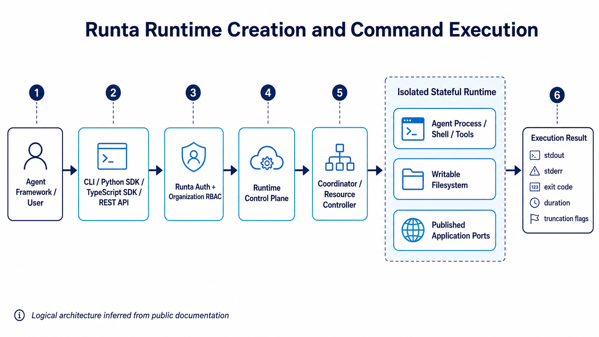
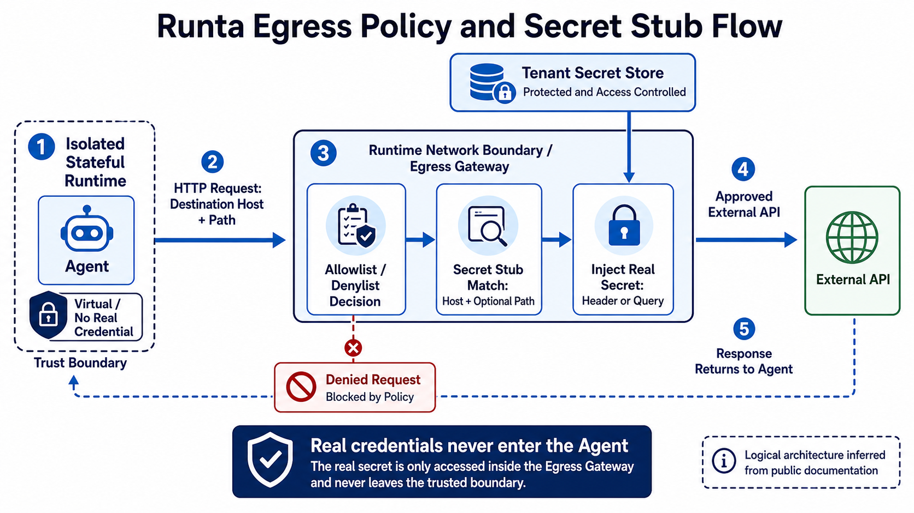
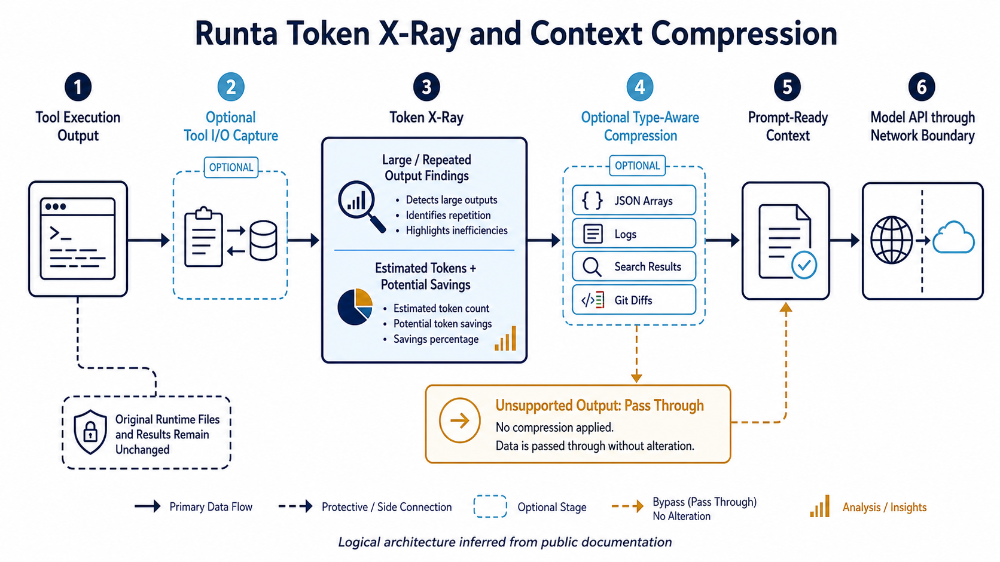
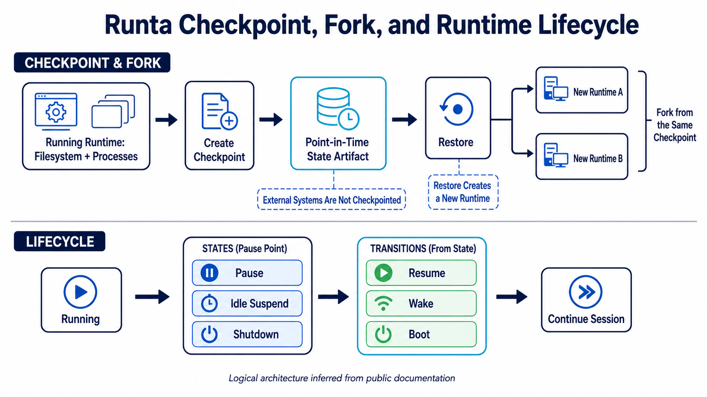
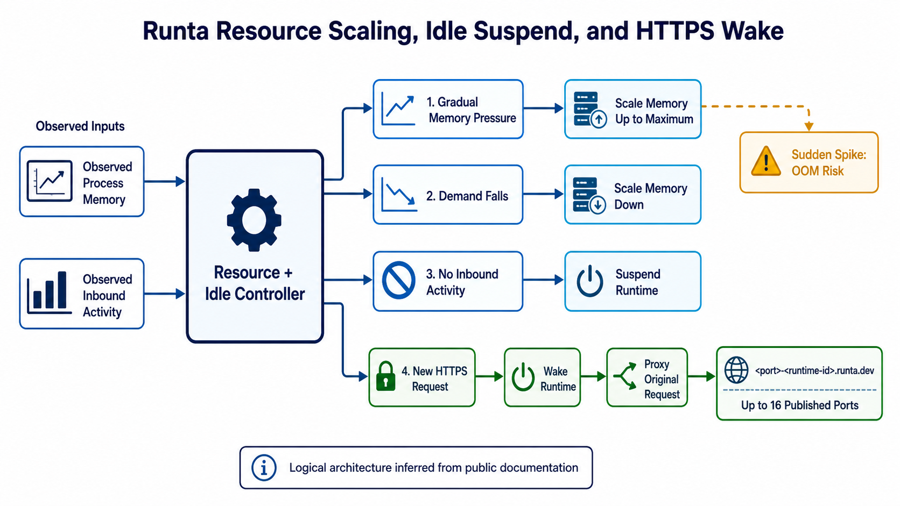
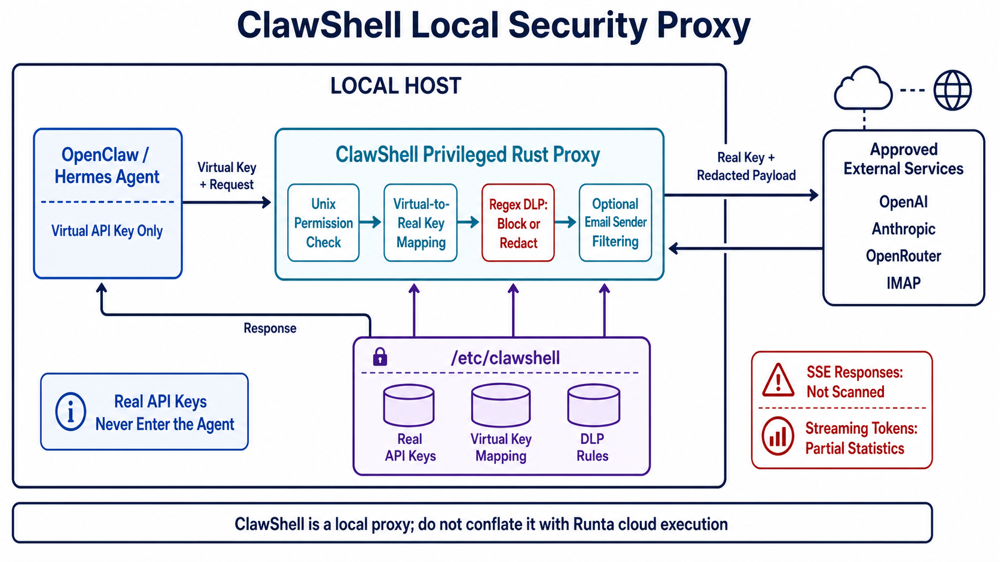

# Research: Runta 公司与 AI Agent Execution Layer

**日期**: 2026-08-12
**Owner**: nieyuanyuan
**状态**: Draft
**源项目 / 分支**: ai_infra_helper / main
**源 commit / 版本**: 调研时点 2026-08-12；Runta Cloud 公开文档；ClawShell `main` 分支公开快照
**相关请求 / 问题**: 调研 Runta 的公司历史、团队与融资、产品体系、架构和关键技术，并分析未来发展方向与企业采用风险

## 修订记录

| 版本 | 日期 | 作者 | 摘要 |
|---|---|---|---|
| v0.2 | 2026-08-12 | nieyuanyuan | 为 4.2.1～4.2.6 补充 6 张英文关键链路与机制说明图。 |
| v0.1 | 2026-08-12 | nieyuanyuan | 初版调研，覆盖公司发展、产品架构、关键技术、商业模式、风险与未来方向。 |

## 1. 摘要

- 调研问题: Runta 是什么公司，产品解决 AI Agent 基础设施的哪一层，技术差异化、成熟度、企业价值与未来发展空间如何？
- 简短结论:
  - Runta 是一家 2025 年成立、2026 年 7 月正式公开的早期 AI Infra 公司。创始人 Guanlan Dai 长期从事 Cloudflare Edge 和 Kong Gateway 等边界基础设施；公司于 2026-07-16 宣布由 Andreessen Horowitz 领投的 2,000 万美元种子轮。
  - 其主产品不是模型、Agent Framework 或单纯 sandbox，而是托管的 **Agent Execution Layer**：向 Agent 提供有状态隔离计算，同时在操作系统和网络边界统一执行资源、文件、出网、凭据、Token 成本、检查点与生命周期策略。
  - 当前公开能力已经形成较完整的产品闭环：CLI、Python/TypeScript SDK、REST API；runtime 创建/执行/暂停/恢复；filesystem 与进程 checkpoint；hostname allowlist；gateway 侧 Secret Stub；Token X-Ray/压缩；内存纵向弹性；自动休眠唤醒；HTTPS ingress；组织 RBAC。
  - 最大技术亮点是把“计算沙箱”和“网络/凭据/成本治理”放进同一个 runtime boundary，避免只靠 Agent 自报行为；最大不确定性则是云 runtime 底层 VMM、隔离强度、调度、审计、SLA、区域、合规和私有化实现尚未充分公开。
  - Runta Cloud 是闭源托管平台；ClawShell 是 Apache-2.0 的本地 Rust 安全代理。后者展示了虚拟密钥替换、DLP 和最小权限代理思路，但不能用其开源程度或安全机制替代对云平台的审计。
- 建议下一步: 将 Runta 作为“受治理的有状态 Agent runtime”候选做 2～3 周 PoC，重点验证安全默认值、真实隔离、checkpoint 一致性、secret 滥用边界、Token 压缩质量、启动/唤醒延迟、故障恢复和 TCO；未取得架构与合规答复前，不直接承载高敏感生产数据。
- 置信度: Medium。公司发布、接口与当前功能为 High；底层实现、安全保证、客户规模、生产成熟度和未来路线因公开信息有限为 Low～Medium。

## 2. 范围

**范围内**:

- 截至 2026-08-12 的公司成立、融资、创始人与团队背景。
- Runta Cloud runtime 的产品定位、功能、API、生命周期、安全与计费模型。
- ClawShell 开源项目与 Runta Cloud 的关系和技术启示。
- 基于公开资料的竞争位置、企业部署难点、风险和未来发展判断。

**范围外**:

- 未对 Runta 执行真实账号注册、benchmark、渗透测试、故障注入或数据删除验证。
- 未审计未公开的云平台源码、VMM、guest kernel、调度器、存储后端和内部控制面。
- 不确认未公开的收入、客户、员工人数、股权、完整估值或融资到账情况。
- 不对 E2B、Modal、Daytona、Docker Sandboxes、BoxLite、Lambda MicroVMs 做完整横向评测。

**假设**:

- “Runta 产品”主要指 `runta.com` 提供的托管云 runtime，而不是仅指 ClawShell。
- “Agent”指能执行命令、修改文件、访问外部服务、调用模型并保留中间状态的自治或半自治软件。
- 官网所称 milliseconds 启动、系统调用审计等均视为厂商声明；在没有公开测量方法或可操作文档前，不视为本调研已验证能力。

## 3. 调研方法

- 已查看的代码 / 文档:
  - Runta 官网、About、定价、服务条款、产品发布与技术博客。
  - Runta Architecture、Runtime Basics、Egress、Secret Stubs、Checkpoints、Token Saving、Auto Suspend、Memory Auto Scaling、Ingress、RBAC、CLI/SDK/REST API 文档。
  - `runta-dev` GitHub 组织与 ClawShell README、源码结构、许可证和仓库元数据。
  - a16z 投资公告以及有限的公司注册与融资交叉来源。
- 使用的命令或查询:
  - 以 Runta、Guanlan Dai、funding、runtime、architecture、security、checkpoint、egress、secret、pricing、SLA、compliance 等关键词检索。
  - 通过 GitHub API 核实公开仓库的创建时间、许可证、语言、star、fork 和更新日期。
- 已检查的外部参考: 见第 9 节；正文关键事实就近附链接。
- 未验证的内容:
  - Runta Cloud 是否使用 microVM、container、KVM、Firecracker 或其他隔离技术。
  - 网络策略能否抵御 DNS rebinding、IP literal、协议隧道和已允许域名上的越权调用。
  - checkpoint 的崩溃一致性、加密、跨版本兼容、恢复时间和终止后擦除。
  - 合规认证、数据驻留、可用区/区域、SLA、RPO/RTO、BYOC/on-prem 和企业支持承诺。

## 4. 调研内容

### 4.1 当前状态

#### 4.1.1 公司概览

| 项目 | 当前公开信息 | 证据与判断 |
|---|---|---|
| 公司主体 | Runta Inc.；公开注册信息显示 2025-11-12 在 California 登记、Delaware 设立，业务为 AI platform | 公司注册聚合页引用 California Secretary of State；正式法律核验仍应直接查监管登记 |
| 创始人 | Guanlan Dai，官网称 Founder，a16z 称 CEO | [Runta About](https://runta.com/about/)与[a16z 投资公告](https://a16z.com/announcement/investing-in-runta/) |
| 核心背景 | Cloudflare 早期 Edge 团队及后续 Edge Platform 负责人；Kong founding engineering leader，覆盖 Gateway、Cloud、Kubernetes Ingress 与 AI Infra | 官网自述；a16z 对 Cloudflare/Kong 经历作了交叉确认 |
| 团队能力 | 官网称团队来自 Cloudflare/Kong 边界基础设施，并有 Tokio、OpenResty 贡献经验；未公开完整成员名单 | 说明其强项在 proxy、gateway、runtime 和高并发系统；具体人员与职责仍待确认 |
| 融资 | 2026-07-16 宣布 2,000 万美元种子轮，a16z 的 Martin Casado 领投 | 公司[发布博客](https://runta.com/blog/runta-the-execution-layer-for-agents/)明确披露金额；a16z 确认领投但未在投资稿重复金额 |
| 参投者 | Jeff Dean、Fei-Fei Li、Ali Ghodsi、Ram Shriram、Thomas Wolf；官网同时展示 Google DeepMind、World Labs、Databricks、Hugging Face 生态标识 | 公开口径更像个人/行业战略背书，不应自动解读为相应公司直接股权投资 |
| 公司阶段 | Seed、产品公开早期；Cloud 服务已有公开注册、定价和文档，但 Terms 明确 preview/beta 能力可随时调整 | 应按早期产品而非成熟云服务设置采购和上线门槛 |
| 主要公开地域 | 公司在美国；第三方招聘资料称湾区与新加坡，但官网未给出完整办公和云 region 清单 | 地域、数据驻留和支持时区需商务确认 |

#### 4.1.2 发展历程

1. **2025-11**：Runta Inc. 完成公开公司登记。此前 Guanlan Dai 已在 Cloudflare 与 Kong 积累 edge proxy、WAF、API gateway、cloud 和 AI gateway 经验。
2. **2026-02-13**：GitHub 上创建 `runta-dev/clawshell`；2 月 18 日发布 ClawShell 博客，以 OpenClaw 为切入点，强调 Agent 不应持有真实 API key，并通过 privileged local proxy 做 DLP 和访问过滤。
3. **2026-04～07**：ClawShell 持续迭代 Rust/Tokio 实现、OAuth、OpenClaw/Hermes 集成和 runtime statistics；2026-07-13 为调研时可见的最近代码推送。
4. **2026-07-16**：Runta 正式公开 Agent Execution Layer 和 2,000 万美元种子轮。产品叙事从“本地 Agent 安全代理”扩大到“有状态、可在本地或云端运行、具备策略接口的新型计算层”。
5. **2026-07～08**：Cloud 文档快速完善 CLI、Python/TypeScript SDK、REST API、checkpoint、Secret Stub、Token Saving、自动休眠、内存弹性、RBAC 和按量计费。
6. **2026-08-05**：创始人文章进一步提出未来可靠性方向：Agent 是包含模型、工具、分支、验证器的概率性 computation graph，需要 checkpoint、恢复、可复现、多路径执行和 commit boundary，而不只是传统进程托管。

#### 4.1.3 产品体系

| 产品 / 接口 | 定位 | 主要能力 | 开放性与成熟度 |
|---|---|---|---|
| Runta Cloud Runtime | 托管的 Agent execution layer | 隔离计算、命令、文件、checkpoint、egress、secret、Token、弹性、ingress、RBAC | 核心平台闭源；正式服务已有 usage-based pricing，但多项功能为 Preview |
| Runta CLI | 面向终端和自动化脚本的操作入口 | `run/ps/exec/inspect/resize/pause/resume/shutdown/rm/cp/checkpoint/egress/secret` | 可安装二进制；公开 GitHub 组织未见 CLI 核心源码仓库 |
| Python SDK | 应用与 Agent framework 集成 | 同步/异步 runtime、file、secret、egress、checkpoint manager | 文档/API 完整度较好；实现源码开放程度未明确 |
| TypeScript SDK | Node/TS Agent 集成 | Promise API 和与 Python 类似的管理对象 | 当前能力面略依赖公开文档核验 |
| REST API | 平台无关控制面 | Bearer auth；runtime/files/secrets/checkpoints/SSH keys 等资源 API | 公开 OpenAPI 风格文档；可用于自建 provider adapter |
| ClawShell | 本地 OpenClaw/Hermes 安全代理 | 虚拟→真实密钥映射、请求/响应 DLP、email sender filter、OAuth、统计 | Apache-2.0、Rust/Tokio；2026-08-12 快照 329 stars、26 forks、140 commits |
| Agent Skills / Integration | 让 Agent 自助安装和使用 Runta | Installer、Demo、CLI、Python、TypeScript skills；Harbor 与 OpenAI Agents SDK 示例 | 展示“Agent 操作 Agent runtime”的分发策略，但 skill 本身也属于供应链输入 |

#### 4.1.4 功能与商业模型

| 维度 | 当前行为 | 限制 / 注意点 |
|---|---|---|
| 计算 | 创建指定 vCPU、baseline memory 与 max memory 的 runtime；可在线调整内存 | CPU 弹性未见同等公开说明；具体上限、实例硬件和噪声邻居未知 |
| 状态 | runtime 可 pause/resume/shutdown/boot；文件和进程可被 checkpoint | checkpoint 一致性与底层格式未公开；restore 会创建新 runtime |
| 网络 | 每 runtime 设置 hostname/wildcard allowlist 或 denylist | 默认是**空 denylist，即开放出网**；策略以 hostname 而非 URL/port 表达，企业需评估粒度 |
| 凭据 | Secret 存储在 tenant；Secret Stub 按 host + 可选 path，在 egress gateway 注入 header/query | 真实 secret 不暴露给 Agent，但 Agent 仍可利用代理向已允许服务发起有权限的恶意请求 |
| Token | Token X-Ray 记录 tool I/O，识别大输出、重复内容/路径/调用；压缩 JSON、log、search、diff | Preview、默认关闭；估算是 `ceil(chars/4)`，不是账单；capture 可能包含敏感应用数据 |
| 弹性 | memory 可在不重建 runtime 的情况下逐步扩缩 | Preview；官方明确不处理突发内存尖峰，只适合渐进增长 |
| 空闲成本 | idle 后 suspend，收到支持的请求自动恢复并转发原请求 | Preview；协调器默认约 60 秒扫描，实际 suspend 晚于 timeout；唤醒延迟未给 SLA |
| Ingress | 最多发布 16 个 HTTP/HTTPS runtime port 到 `runta.dev` URL | 产品文档未展示应用级 auth/WAF；公开服务必须自行鉴权、限流和验证 TLS/域名策略 |
| 组织权限 | Owner/Admin/Developer 固定 RBAC；API key scope 不超过创建者权限 | 角色粒度较粗；尚未看到 SSO/SCIM、自定义角色、审批或外部 SIEM 文档 |
| 计费 | running 收 vCPU、memory、disk；paused/suspended/shutdown 只收 disk；deleted 不收费 | 2026-08-12 公价：$0.0504/vCPU-hour、$0.0162/GiB-hour、$0.000108/GiB-hour disk；网络、checkpoint 与企业价格需确认 |
| 试用 | $50 credit，无信用卡；1 active runtime、2 vCPU、4 GiB 上限 | 是产品试用条件，不代表生产 quota 或 SLA |

### 4.2 关键链路 / 机制

以下架构是基于公开 API 和产品文档归纳的**逻辑架构**，不是 Runta 未公开内部实现的复刻。

#### 4.2.1 Runtime 创建与执行链路

```text
[Agent Framework / User]
  -> [CLI / Python SDK / TypeScript SDK / REST API]
  -> [Runta Auth + Organization RBAC]
  -> [Runtime Control Plane]
  -> [Coordinator / Resource Controller]
  -> [Isolated Stateful Runtime]
       -> [Agent process / shell / tools]
       -> [Writable filesystem]
       -> [Published application ports]
  -> [stdout / stderr / exit code / duration / truncation flags]
```



*Figure 1. Runta runtime creation, governance, resource coordination, and command execution path.*

- 重要行为: runtime 创建时指定 vCPU、baseline/max memory、ingress、idle、egress、Token capture/compression 与可选 Agent manifest；命令既支持 buffered one-shot，也支持 interactive shell。
- 边界 / 归属: Bearer token/API key 控制控制面；组织 RBAC 控制谁能创建 runtime、管理 secret 和 API key；runtime 是 Agent 代码的执行边界。
- 运行时或运维注意点: 文档 API 的状态包括 `creating/running/paused/shutdown/suspended/crashed/error/deleting`，上层必须实现幂等、timeout、重试和终态对账。公开资料没有说明 underlying isolation，因此不能仅凭“isolated computer”推断 VM 级安全。

#### 4.2.2 出网策略与 Secret Stub

```text
[Agent holds no real credential]
  -> [HTTP request to destination host/path]
  -> [Runtime Network Boundary / Egress Gateway]
       -> [Allowlist / Denylist decision]
       -> [Secret Stub matches host + optional path]
       -> [Inject real secret into header or query]
  -> [Approved External API]
  -> [Response returns to Agent]
```



*Figure 2. Egress policy evaluation and gateway-side secret injection without exposing real credentials to the Agent.*

- 重要行为: Secret Stub 将 `${credential}` 替换为 tenant secret；同一规则可按 runtime 或 tenant default 配置。网络策略每次 set 都整体替换，并对 hostname/wildcard 做小写、排序和去重。
- 边界 / 归属: Secret value 属于平台/组织管理面，Developer 可以使用已配置 secret 但看不到 Secrets 页面；Agent 只发无真实凭据的请求。
- 运行时或运维注意点: 默认空 denylist 允许全部外联，不符合高敏环境的 default-deny 预期。host/path 匹配减少泄密，却不理解外部 API 的业务授权；需要额外限制 method、tenant/resource scope、额度和 side effect。

#### 4.2.3 Token X-Ray 与压缩链路

```text
[Tool execution output]
  -> [Optional Tool I/O Capture]
  -> [Token X-Ray]
       -> [Large / repeated output findings]
       -> [Estimated tokens and potential savings]
  -> [Optional type-aware compression]
       -> [JSON arrays | Logs | Search results | Git diffs]
  -> [Prompt-ready context]
  -> [Model API through network boundary]
```



*Figure 3. Optional Tool I/O capture, Token X-Ray analysis, type-aware compression, and pass-through behavior.*

- 重要行为: Runta 不修改 runtime 内原始文件或原始 command result，而是在内容进入模型上下文前压缩；未知格式 passthrough。
- 边界 / 归属: 这是 execution layer 对 Agent 经济性的差异化控制点，位于 tool output 与 model call 之间，能同时观察计算资源和 Token 消耗。
- 运行时或运维注意点: 压缩可能丢失影响推理的长尾信息，必须用 task success rate/semantic fidelity 而不是 token saving 单指标评估。capture 内容是 untrusted 且可能包含源代码、日志、PII 和 secret，需确认加密、留存、访问和删除。

#### 4.2.4 Checkpoint、暂停与恢复

```text
[Running Runtime: filesystem + processes]
  -> [Create Checkpoint]
  -> [Point-in-time State Artifact]
  -> [Restore]
  -> [New Runtime A]
  -> [New Runtime B ... fork from same checkpoint]

[Running] -> [Pause / Idle Suspend / Shutdown]
  -> [Resume / Wake / Boot]
  -> [Continue Session]
```



*Figure 4. Point-in-time checkpoint creation, restore-to-new-runtime fork semantics, and runtime lifecycle transitions.*

- 重要行为: checkpoint 包括 filesystem 和 running processes，同一个 checkpoint 可多次 restore/fork；restore 的语义是创建新 runtime，而非原地回滚。
- 边界 / 归属: runtime state 与用户创建的 checkpoint 都是 tenant 持久资产；paused/suspended/shutdown 仍保留 disk 并产生存储费。
- 运行时或运维注意点: 外部数据库、queue、network connection、lease 和一次性 token 不会因为本地进程恢复自动获得一致性。应用需要 checkpoint hook、idempotency、credential refresh 和 side-effect commit boundary。

#### 4.2.5 弹性、空闲控制与服务发布

```text
[Observed process memory / inbound activity]
  -> [Resource + Idle Controller]
       -> [Gradual memory pressure: scale up to max]
       -> [Demand falls: scale memory down]
       -> [No inbound activity: suspend]
       -> [New HTTPS request: wake runtime, then proxy request]
  -> [Published Service: <port>-<runtime-id>.runta.dev]
```



*Figure 5. Memory scaling, idle suspension, HTTPS-triggered wake, and ingress request forwarding.*

- 重要行为: memory 从 baseline 到 max 纵向变化，不重建 runtime；idle coordinator 定期扫描；支持 HTTP/HTTPS ingress 与最多 16 个端口。
- 边界 / 归属: Runta 负责基础设施 resource state 与入口代理，应用仍负责 readiness、auth、session、backpressure 和业务级限流。
- 运行时或运维注意点: 突发内存尖峰仍可能 OOM；首次唤醒会增加请求延迟；只把 inbound HTTP 当 activity 可能误判后台任务。需验证长连接、WebSocket、异步 job 和无入口 Agent 的 idle 语义。

#### 4.2.6 ClawShell 本地安全代理

```text
[OpenClaw / Hermes: virtual key]
  -> [ClawShell privileged Rust proxy]
       -> [Unix permission protected config]
       -> [Virtual-to-real key mapping]
       -> [Regex DLP: block or redact]
       -> [Optional email sender filtering]
  -> [OpenAI / Anthropic / OpenRouter / IMAP]
```



*Figure 6. ClawShell local privilege boundary, virtual-key mapping, DLP filtering, and controlled external access.*

- 重要行为: real key 存在 `/etc/clawshell`，由专用 system user 和 Unix 权限隔离；支持 provider header 适配、OAuth device flow、token refresh 和部分请求格式转换。
- 边界 / 归属: ClawShell 是本机 privileged process 与 Agent 之间的 filesystem/process boundary，不等于 Runta Cloud 的 tenant/runtime boundary。
- 运行时或运维注意点: regex DLP 容易漏掉编码、分片、语义化 PII；README 明确 SSE response 不扫描，streaming token 统计也不完整。ClawShell 拥有真实 secret，本身是高价值攻击面，需要最小权限、升级、日志脱敏和配置备份策略。

### 4.3 关键发现

#### Finding 1: Runta 的定位是“sandbox + policy gateway + state/cost control”

- 证据: 架构文档把 runtime、Secret Stub、checkpoint、Token X-Ray、autoscaling 和 network access control 放在同一平台；创始人明确主张治理点必须位于 Agent 行为“变成现实”的执行边界。
- 为什么重要: 单一 sandbox 只隔离代码，不能自动解决凭据、出网、Token 浪费、空闲计算和恢复。Runta 尝试把这些原本分散在容器平台、API gateway、vault、observability 和 FinOps 的能力合并。
- 置信度: High（产品定位）；Medium（跨层能力的生产效果）。

#### Finding 2: 团队经历与产品问题高度匹配

- 证据: 创始人和团队公开背景集中于 Cloudflare Edge、WAF、Kong Gateway/Cloud/Kubernetes/AI Gateway，以及 Tokio/OpenResty。
- 为什么重要: Agent execution layer 需要高并发 proxy、policy enforcement、runtime、网络和控制面经验；这是比单纯 LLM 应用背景更直接的 founder-market fit。但完整团队、组织规模和关键 subsystem owner 尚未披露。
- 置信度: Medium～High。

#### Finding 3: Secret Stub 降低“密钥被读走”风险，但不解决“代理权限被滥用”

- 证据: real secret 在 egress gateway 按 host/path 注入，Agent 不持有明文；但请求内容和目标操作仍来自 Agent。
- 为什么重要: prompt injection 即使拿不到 key，也可能借 gateway 对允许 API 执行删除、转账、写仓库等合法但恶意的操作。企业必须使用最小权限 upstream credential、细粒度 resource scope、审批和额度，而不能只依赖“不泄露密钥”。
- 置信度: High。

#### Finding 4: Token Saving 是有价值的差异化，但也是新的正确性与数据治理面

- 证据: 产品能识别重复 tool output，并对 JSON/log/search/diff 做类型化压缩；capture 和 compression 默认关闭且为 Preview。
- 为什么重要: Token 成本和上下文膨胀是长周期 Agent 的真实瓶颈；在 execution layer 观察 tool I/O 比 Agent framework 插件更统一。但压缩错误可改变 Agent 决策，capture 又会集中敏感数据，需要 eval、审计和 retention policy。
- 置信度: High（机制）；Low～Medium（实际节省和质量）。

#### Finding 5: Checkpoint/fork 可能成为长周期 Agent 与评测基础设施的核心

- 证据: checkpoint 同时保存 filesystem 和 processes，并可多次恢复到新 runtime；创始人未来文章强调概率性 computation graph、可复现、恢复和多路径执行。
- 为什么重要: 这不仅用于故障恢复，也可用于 speculative branch、A/B model execution、Agent evaluation、人工审批前冻结和失败后重放，是比 ephemeral code sandbox 更宽的产品方向。
- 置信度: Medium。当前 checkpoint API 已存在，面向 computation graph 的高级编排仍属于方向判断。

#### Finding 6: 产品对“默认安全”仍有明显改进空间

- 证据: runtime 的空 denylist 是默认开放出网；Token capture/压缩需主动开启；公开 ingress 示例没有应用鉴权；底层隔离和合规信息不足。
- 为什么重要: Runta 的核心卖点是 governance，企业会用更高标准审视 defaults、可证明隔离和审计。默认开放可能有利于试用体验，却增加用户误配置风险。
- 置信度: High。

#### Finding 7: 开源策略目前是边缘组件开放、核心云平台闭源

- 证据: GitHub 组织只有 ClawShell 和 Homebrew tap 两个公开仓库；CLI/SDK/runtime 核心没有可见的完整开源仓库。
- 为什么重要: ClawShell 有助于传播 security boundary 理念并覆盖本地 Agent，但企业不能据此审计 Cloud runtime。相比开源 runtime 路线，Runta 更依赖服务可信度、SLA、合规和数据可携性。
- 置信度: High（2026-08-12 快照）。

#### 4.3.1 与相邻方案的产品边界

| 相邻类别 | 典型价值 | Runta 的相对位置 |
|---|---|---|
| 容器 / microVM sandbox | 隔离不可信代码和 host kernel | Runta 向上加入 secret、egress、Token、checkpoint、RBAC 和成本控制；底层隔离透明度反而较少 |
| Serverless / job runtime | 托管调度、弹性和计费 | Runta 强调完整有状态 computer、长周期 Agent、pause/resume/fork，而不只是无状态 handler |
| API / LLM gateway | auth、rate limit、model routing、cost visibility | Runta 把 gateway 放到每个 Agent 的 execution/network boundary，并关联 runtime/task state |
| Secrets manager | 保存、轮换和授权 secret | Secret Stub 重点是 JIT request injection；企业仍可能需要 Vault/KMS、upstream credential 生命周期与审批 |
| Agent framework | planning、tool calling、memory、workflow | Runta 声称不要求替换 framework，而提供其下方执行层；当前公开集成仅覆盖少数框架示例 |
| EDR / DLP / SIEM | endpoint detection、data protection、审计关联 | Runta/ClawShell 有 enforcement/DLP 信号，但未见与成熟安全产品相同的检测、响应和合规覆盖 |

#### 4.3.2 未来发展判断

| 方向 | 公开信号 | 判断与前提 |
|---|---|---|
| 从 sandbox 到通用 Agent computer | a16z 强调 full OS、stateful、local/cloud；Runta 称不是 another sandbox cloud | 很可能继续扩大 runtime、网络、文件、身份、成本和审计的统一控制面 |
| 长周期 Agent reliability | checkpoint/fork 已存在；创始人讨论 computation graph、reproducibility、recovery、commit boundary | 可能发展 workflow checkpoint、分支执行、验证/投票、回滚和 side-effect transaction，但当前未形成公开承诺 |
| 本地与企业混合部署 | ClawShell 是本地入口，投资公告提及 local/cloud | 可能出现 local runtime、BYOC 或混合策略层；目前官网主产品仍是托管 cloud，私有化能力需确认 |
| 经济性治理 | Token X-Ray/Compression、memory autoscaling、idle suspend 和 usage pricing 已组合 | 有机会形成 Agent FinOps：按 task/agent/model/tool 归因成本、预算和策略；目前计量与 dashboard 深度有限 |
| 安全与合规产品化 | Secret Stub、egress、RBAC、ClawShell DLP 已具雏形 | 企业增长将迫使其补 SSO/SCIM、自定义 RBAC、immutable audit、SIEM、regional residency、SOC 2 等；不能假设已经具备 |
| Framework-neutral ecosystem | 提供 Python/TS/REST、skills、Harbor/OpenAI Agents 示例 | 若 provider API 稳定，可成为多 framework 公共执行后端；需扩大 LangGraph/CrewAI/Codex 等集成和版本兼容 |
| 开源策略 | ClawShell 开源，Cloud 核心闭源 | 可能继续以边缘工具开源获客，而核心 control/data plane 商业化；是否开放 runtime substrate 尚无信号 |

### 4.4 GAP 和风险

| GAP / 风险 | 影响 | 证据 | 严重程度 |
|---|---|---|---|
| 底层隔离未披露 | 无法判断 container escape、VM boundary、共享 kernel 和多租户攻击面 | 文档仅称 isolated computer / OS-level control，未说明 VMM/kernel | High |
| 默认开放出网 | 新 runtime 可能在未配置时访问任意外部地址 | Egress 文档明确 empty denylist 是 default open policy | High |
| 代理权限滥用 | Agent 不知道 secret 仍能调用高权限 API 完成副作用 | Secret Stub 只在 host/path 匹配后注入 credential | High |
| checkpoint 外部一致性 | 恢复后可能重复提交、使用过期 lease/token 或破坏数据库状态 | checkpoint 保存 local filesystem/processes，不等于分布式事务 | High |
| Token 压缩损害正确性 | 丢失关键日志、diff 或搜索结果会改变 Agent 决策 | Preview、启发式类型压缩，尚无公开质量 benchmark | High |
| Token capture 数据集中 | 源码、PII、日志和潜在 secret 进入分析面 | 官方提醒 captured payload 可能含 application data | High |
| 云平台透明度和锁定 | 无法自修复/审计；checkpoint/API/域名与平台绑定 | Cloud 核心未开源，restore/runtime 语义专有 | Medium～High |
| 企业合规资料不足 | 金融、政企和医疗无法完成采购/数据驻留评估 | 未检索到 SOC 2、ISO、region、DPA、SLA 的充分公开说明 | High |
| 产品早期和 Preview 密集 | API/行为可能变化，生产兼容与支持未知 | 2026-07 正式公开；Terms 对 beta/preview 不保证兼容 | High |
| 内存突发不受保护 | build/compiler/恶意 workload 可在 controller 扩容前 OOM | autoscaling 文档明确只处理 gradual increase | Medium |
| 自动休眠误判 | 后台 Agent 无 HTTP activity 时可能被错误 suspend | idle detection 以 supported activity/ingress 为核心，扫描有延迟 | Medium |
| Ingress 暴露面 | 发布的服务可能缺乏应用认证、WAF、rate limiting | 文档只展示公开 `runta.dev` URL 和最多 16 ports | High |
| ClawShell DLP 绕过 | 编码、流式、语义化敏感内容可能泄漏 | regex DLP；SSE response 明确不扫描 | Medium～High |
| 审计承诺与可用接口有落差 | 难以证明 system call、filesystem、credential 级审计可导出和防篡改 | 发布博客描述完整记录，公开 docs/API 未见同粒度 audit export | High |
| 供应链 | Agent skill、post-install script、package 和 runtime tool 可执行外部代码 | create API 包含 agent post-install；skills 是自动化输入 | Medium～High |

## 5. 可选方向

| 方案 | 描述 | 适合场景 | 成本 / 风险 | 建议 |
|---|---|---|---|---|
| A：Runta Cloud 全托管 | 通过 SDK/API 直接使用 runtime、secret、egress、checkpoint、Token 和弹性 | Startup、Agent SaaS、快速 PoC、团队不想运维 sandbox fleet | 云锁定、底层透明度、合规与早期成熟度 | 中低敏场景优先 PoC，不直接承载高风险生产 |
| B：Runta 作为受限执行后端 | 上层保留自有 Agent orchestrator、IAM、vault、audit 和 provider abstraction，只把执行委托给 Runta | 希望快速获得 runtime，但保留控制面和可迁移性 | 需要双层策略映射和审计关联 | 企业采用的推荐形态 |
| C：仅采用 ClawShell | 在本机 OpenClaw/Hermes 前部署开源 proxy | 个人/小团队、本地密钥隔离、基础 DLP | 不提供 Cloud runtime、强 VM 隔离或完整企业治理；privileged daemon 风险 | 适合独立安全加固，不替代 Cloud 平台评估 |
| D：自建开源 sandbox + 企业控制面 | 采用 BoxLite/Firecracker/Kata 等，加自有 gateway/vault/observability | 强数据主权、私有化、可审计和多云 | 研发与运维成本最高，需自己实现 Runta 的跨层闭环 | 合规驱动时作为对照组 |
| E：双 Provider | Runta 负责公有云弹性，自建后端负责高敏任务，上层统一接口 | 数据分级明显、需灾备或议价能力 | 最复杂，checkpoint/secret/network 语义难统一 | 规模足够且已有平台团队时考虑 |

## 6. 建议

**建议方向**:

将 Runta 放入 Agent Runtime 候选池，但采用“受限执行后端”而非一开始把身份、secret、审计和业务治理全部绑定到其平台。PoC 通过后，先上线可回滚、低敏、外部副作用有限的任务，再逐步扩大权限。

**原因**:

- 产品确实覆盖了传统 sandbox 缺失的 Agent 特有问题：长状态、凭据代理、出网、Token/计算成本和恢复。
- 团队的 edge/gateway/runtime 背景与 execution boundary 问题匹配，2,000 万美元种子轮为继续补齐产品提供资源。
- 但公司和产品都很早期，核心安全主张所需的 VMM、审计、合规、SLA 与数据生命周期证据不足。
- 采用 provider abstraction 可保留迁移选择，也便于与现有 microVM、自建容器或 Lambda MicroVMs 做同条件比较。

**应该进入设计文档的内容**:

- `RuntimeProvider` 接口：create、exec、files、checkpoint、restore、pause/resume、terminate、capabilities。
- 身份映射：企业 user/service account → Runta organization role/API key → runtime/task。
- default-deny egress、DNS/IP/port/method/resource 级补充策略与 policy-as-code review。
- secret 使用的 upstream 最小权限、短期 token、额度、审批、rotation 和 resume refresh。
- checkpoint 前后 hook、外部副作用 ledger、idempotency、版本兼容和销毁证明。
- Token capture 的数据分类、脱敏、留存、访问、export/delete 与压缩质量 eval。
- runtime quota、idle、memory max、ingress auth、timeout、kill switch 和 cost budget。
- Provider fallback、导出格式、灾备与退出计划。

**不应该进入设计文档的内容**:

- 未验证的 milliseconds 启动、安全等级、审计完整性或 Token 节省比例。
- 把 ClawShell 的 Apache-2.0、Unix 权限和 DLP 能力外推为 Runta Cloud 的实现或保证。
- 未经合同确认的区域、SLA、合规、数据删除和私有化承诺。

## 7. 验证要求

- 单元 / 组件:
  - runtime 状态机、重复请求幂等、timeout、取消、crashed/error/deleting 对账。
  - allowlist/denylist 的 wildcard、大小写、IDN、DNS rebinding、CNAME、IPv4/IPv6、redirect 和非 HTTP 流量。
  - Secret Stub 的 host/path/method、redirect、header/query 注入、日志脱敏和跨 runtime/tenant 隔离。
  - Token compression 对 JSON/log/search/diff 的 golden set 与 semantic fidelity。
- 集成 / workflow:
  - LangGraph/OpenAI Agents/自有 framework 的长周期任务；文件、process、网络和 secret 组合路径。
  - checkpoint 时有子进程、open file、socket、database transaction、queue message、lease 的恢复行为。
  - 1→8 GiB 渐进增长与突发增长，验证 scale latency、OOM 和降配行为。
  - idle suspend/wakeup 对 HTTP、WebSocket、background job、interactive shell 和无 ingress Agent 的判定。
- 端到端 / 运维:
  - 100/1,000 并发 runtime 的 create-to-ready P50/P95/P99、exec、wake、restore、失败率和成本。
  - 区域故障、控制面不可用、节点 crash、checkpoint service 故障、余额耗尽、quota 和 rate limit。
  - 从企业 identity 到 system/network/file/secret/Token event 的完整 audit trail 与 SIEM 导出。
- 回归:
  - 固定 CLI/SDK/API 版本，针对 Preview 行为建立 contract tests。
  - Agent framework、runtime image、package 与 policy 更新后重跑安全和任务成功率基准。
- 负向 / 失败场景:
  - Prompt injection 诱导访问未允许域、利用允许 API 删除资源、secret exfiltration、DNS/redirect 绕过。
  - Fork bomb、disk fill、memory spike、10 MB log、重复 tool call、恶意 JSON/diff 和 compression poisoning。
  - ClawShell 编码 PII、chunked/SSE response、配置权限篡改、daemon crash 和 OAuth refresh failure。

PoC 统一记录：create-to-ready、first exec、pause/resume、checkpoint/restore、P95 tool call、task success、压缩前后 token、false positive/negative、vCPU/memory/disk 小时、网络量、失败恢复和人工介入次数。

## 8. Open Questions

- [ ] Runta Cloud 的隔离原语到底是 microVM、VM、container 还是其他方案？是否每 tenant/runtime 独立 kernel？
- [ ] VMM、guest kernel、host hardening、seccomp/LSM、nested container 和 patch cadence 如何设计？
- [ ] 已完成哪些第三方 pentest、SOC 2/ISO 认证，是否提供安全白皮书、CVE 和 incident response SLA？
- [ ] Cloud region、AZ、data residency、DPA、加密密钥、backup 和删除证明是什么？
- [ ] checkpoint 是否 crash-consistent，如何处理 network connection、clock、randomness、credential 和 runtime 版本升级？
- [ ] 发布博客所称 system call/network/filesystem/credential audit 在哪里配置、查询、导出和防篡改？
- [ ] Egress gateway 如何处理 DNS rebinding、redirect、IP literal、non-HTTP、TLS inspection 和 private network？
- [ ] Secret Stub 是否支持 method/body/resource/额度级 policy、短期 credential 和人工审批？
- [ ] Token capture 是否持久化，默认 retention、encryption、region、RBAC 和 delete/export API 是什么？
- [ ] Memory autoscaling 的 sampling、阈值、扩缩延迟、OOM 保护和收费粒度是什么？
- [ ] 是否支持 custom image、Docker/OCI、GPU、privileged workload、volume、VPC/private endpoint 和 on-prem/BYOC？
- [ ] 生产 quota、SLA、support、版本兼容和灾备承诺是什么？
- [ ] 2,000 万美元以外是否存在未公开轮次；完整创始团队、员工规模和客户验证如何？

## 9. 来源记录

除特别说明，动态页面最后核查日期均为 2026-08-12。

| 来源 | 日期 / 版本 | 备注 |
|---|---|---|
| [Runta 官网](https://runta.com/) | 2026-08-12 | 产品定位、Token/compute/credential/egress 价值主张 |
| [Runta About](https://runta.com/about/) | 2026-08-12 | 创始人、团队经历和投资者 |
| [Runta: the execution layer for agents](https://runta.com/blog/runta-the-execution-layer-for-agents/) | 2026-07-16 | 正式发布、2,000 万美元种子轮、产品原则和厂商性能/审计声明 |
| [a16z: Investing in Runta](https://a16z.com/announcement/investing-in-runta/) | 2026-07-16 | 领投、CEO 背景、local/cloud 与 agent computer 方向 |
| [Agents aren't software](https://runta.com/blog/agents-arent-software/) | 2026-08-05 | 概率性 computation graph、可靠性、可复现和恢复方向 |
| [Runta Architecture](https://runta.com/docs/overview/) | 2026-08-12 | Cloud 逻辑架构、功能与接口总览 |
| [Runtime Basics](https://runta.com/docs/runtime/runtime-basic/) | 2026-08-12 | 创建、exec、resize、pause/resume/shutdown/delete |
| [Runta REST Create Runtime](https://runta.com/docs/reference/api/operations/createruntime/) | 2026-08-12 | runtime schema、resource、idle、egress、Token 与 ingress 参数 |
| [Runta CLI](https://runta.com/docs/reference/cli/) | 2026-08-12 | CLI command groups 和功能面 |
| [Egress](https://runta.com/docs/runtime/egress/) | 2026-08-12 | allowlist/denylist、hostname pattern 和默认开放策略 |
| [Secret Stubs](https://runta.com/docs/runtime/secrets-and-secret-injection/) | 2026-08-12 | tenant secret、host/path rule 和 gateway 注入 |
| [Token Saving](https://runta.com/docs/runtime/token-x-ray/) | Preview，2026-08-12 | X-Ray、估算限制、capture 风险与类型化压缩 |
| [Checkpoints](https://runta.com/docs/runtime/checkpoints/) | 2026-08-12 | filesystem/process capture、restore/fork/delete |
| [Auto Suspend and Wake-Up](https://runta.com/docs/runtime/auto-suspend-and-wake-up/) | Preview，2026-08-12 | idle scan、自动挂起和请求唤醒 |
| [Memory Auto Scaling](https://runta.com/docs/runtime/memory-auto-scaling/) | Preview，2026-08-12 | baseline/max、在线扩缩与突发限制 |
| [Publish a Service](https://runta.com/docs/runtime/publish-a-service/) | 2026-08-12 | HTTP/HTTPS ingress、runta.dev URL、16 port 上限 |
| [Team Access and Roles](https://runta.com/docs/organization/team-access-and-roles/) | 2026-08-12 | Owner/Admin/Developer、secret 与 API key 权限 |
| [Pricing](https://runta.com/pricing/) | 2026-08-12 | 资源单价、状态计费、试用和预付费模型 |
| [Terms of Service](https://runta.com/terms-of-use/) | revised 2026-07-16 | Runta Inc.、Cloud/SDK/API 服务边界、Preview 与计费条款 |
| [Runta GitHub organization](https://github.com/runta-dev) | 2026-08-12 | 公开仓库范围与组织规模信号 |
| [ClawShell GitHub](https://github.com/runta-dev/clawshell) | main，2026-08-12 | Apache-2.0、Rust/Tokio、virtual key、DLP、OAuth、email 与已知限制 |
| [Introducing ClawShell](https://runta.com/blog/introducing-clawshell/) | 2026-02-18 | 本地安全代理的问题背景与 Runta 早期产品切入点 |
| [Runta 公司注册聚合记录](https://www.bizprofile.net/ca/san-mateo/runta-inc) | 数据提取于 2026-04-01 | 2025-11-12 登记、Delaware/California 主体；非官方一手页面，需法律核验 |
| [The Information 融资摘要](https://www.theinformation.com/newsletters/ai-agenda/andreessen-horowitz-backs-startup-aiming-parent-ai-agents) | 2026-07 | 2,000 万美元和 1 亿美元以上估值的媒体口径；估值未由公司官网确认 |

## 10. 结论

- 是否进入设计: Yes，作为 PoC 候选，不代表生产批准。
- 要创建的设计文档: `docs/designs/2026-XX-XX-governed-agent-runtime-evaluation-zh.md`，待安全与平台团队确认范围后定日期。
- 实现前还需要补充的调研:
  - 获取 Runta 的 security architecture、隔离原语、审计接口、SLA、region、合规和 data lifecycle 正式答复。
  - 与一个开源自建 runtime 和一个成熟托管 microVM 方案执行同条件 benchmark/threat model/TCO。
  - 对 Secret Stub 做 confused-deputy 与 authorized-action abuse 测试，而不只验证 secret 是否可读取。
  - 对 checkpoint 外部一致性和 Token compression 任务成功率建立专项 eval。

综合判断：Runta 抓住了一个真实且正在扩大的基础设施缺口——Agent 需要的不只是隔离环境，还需要在动作发生时统一约束访问、凭据、状态和成本。它的产品组合与团队经历具有较强一致性，checkpoint、Secret Stub 和 Token/compute 双重治理尤其值得关注。但截至 2026-08-12，Runta 仍是一家刚公开、核心平台闭源、底层安全与企业保证披露不足的 Seed 公司。最合理的态度不是忽视，也不是直接押注，而是用严格 PoC 验证其“execution layer”能否在真实企业任务中同时兑现隔离、治理、可靠性和经济性。
