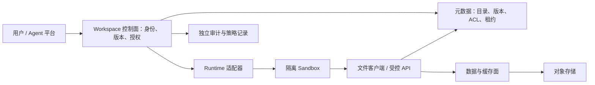
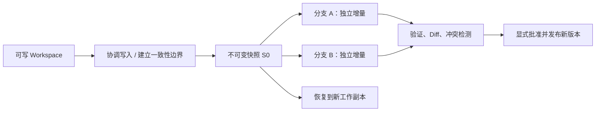

# Research: Agent Workspace 定义、业界实践、关键技术与未来场景

**日期**: 2026-09-24
**Owner**: nieyuanyuan
**状态**: Draft
**源项目 / 分支**: ai_infra_helper / main
**源 commit / 版本**: 仓库基线 `fc2b637`；Agentore 单页介绍 PDF（未标版本）；公开资料访问时点 2026-09-24
**相关请求 / 问题**: 从 Agentore 介绍出发，调研 Agent Workspace 的定义、业界最佳实践、关键技术与未来使用场景

## 修订记录

| 版本 | 日期 | 作者 | 摘要 |
|---|---|---|---|
| v0.1 | 2026-09-24 | nieyuanyuan | 初版调研，分析 Agentore 提案，梳理 Workspace 的概念边界、代表实践、六条关键机制、场景构想和 PoC 验证要求。 |

## 1. 摘要

- 调研问题: Agent Workspace 是否是一个独立基础设施层？已有组件能够覆盖哪些能力？如果建设或采用这种系统，最值得验证的技术与场景是什么？
- 简短结论:
  - **本文采用的工作定义**：Agent Workspace 是面向任务或项目、具有稳定身份和访问边界、可跨执行会话保留工作状态与产出物的逻辑工作空间。它可以由多个存储与执行组件共同实现，不要求所有数据进入同一个物理文件系统。这是基于公开实践归纳的定义，不是已发布的统一行业标准。
  - 附件 Agentore 的定位更具体：提供可挂载、可编程、可版本化、可治理的**持久数字资产层**，位于 Agent 平台与 Sandbox 之下。其价值主张与计算和状态解耦的工程方向吻合；是否已实现、性能如何、开源边界是什么，尚需产品证据。
  - 业界已有三类实践：框架提供文件和记忆抽象；Sandbox/云平台提供持久卷与运行状态恢复；存储系统提供命名空间、克隆与版本管理。它们覆盖不同层次，不能直接按一个功能列表判定谁是完整 Workspace 产品。
  - **关键技术集中在状态语义**：文件与 API 的一致视图、跨文件快照、CoW 分叉、并发冲突、身份与权限传播、缓存一致性，以及 Workspace 版本和 Agent checkpoint 的关联。FUSE、NFS 或 S3 本身都不能单独解决这些问题。
  - 最先值得验证的是长任务编程/分析、可审核的企业知识工作、评测环境快速分叉。数字员工长期工作台、跨 Runtime 迁移和 Agentic RL 资产底座是有潜力的后续方向，但需要更完整的状态与治理契约。
- 建议下一步: 先用成熟存储和执行组件构建小范围 PoC，以任务成功率、恢复正确性和每次成功任务成本评估是否需要专门的 Workspace 层。
- 置信度: **Medium**。被引用的公开接口与机制为 High；跨产品架构归纳为 Medium；Agentore 实现成熟度、商业壁垒和未来场景规模为 Low～Medium。

## 2. 范围

**范围内**:

- 附件 Agentore 的产品定位、技术主张和能力边界。
- AI Agent 的 Workspace、Sandbox、Memory、Session、Artifact 与文件系统之间的关系。
- Anthropic、LangChain/LangGraph、AWS AgentCore、E2B、Daytona、Modal，以及 JuiceFS、lakeFS、Git 等可借鉴实践。
- 多租户、持久化、快照、上下文组织、协作与恢复机制；落地路线和未来场景。

**范围外**:

- 不做 Agentore 的财务、融资或团队履历尽调；附件中的团队与规模描述不作为独立验证结果。
- 不宣称完成任何产品 benchmark、源码审计、生产试用或安全测试。
- 不对全部 Agent 平台做穷尽排名，不把本文推导的参考架构归属于某家厂商。

**假设**:

- 关注会执行工具、读写文件并跨会话工作的 AI Agent，而非传统客服坐席软件中的同名工作台。
- “统一”优先指统一身份、命名空间、访问和治理；允许文件、结构化状态、审计与索引分别使用适合的后端。
- 厂商文档证明其公开产品语义，不等于本调研已验证 SLA、性能、隔离强度或恢复保证。

## 3. 调研方法

- 已查看的代码 / 文档: 完整提取并渲染检查附件 1 页；阅读本仓库中文调研模板；查阅第 9 节列出的厂商技术文档、规范、官方工程文章及研究论文摘要。未进行逐行源码审计。
- 使用的命令或查询: 本地使用 `pypdf` 提取、`pypdfium2` 渲染、`shasum -a 256` 识别附件；公开检索使用 `Agentore Workspace`、`persistent agent workspace`、`filesystem backends`、`sandbox persistence`、`volume snapshot`、`workspace benchmark` 等主题。
- 已检查的外部参考: 优先一手来源；正文按来源链接就近标注，第 9 节保留访问日期和版本范围。
- 证据分层: **附件主张**仅表示介绍材料写了什么；**公开事实**表示一手资料明确描述的机制；**本文分析/建议**表示由这些事实推导的架构或落地选择；**场景构想**不视为既有客户案例。
- 未验证的内容: Agentore 可运行版本、仓库和许可证、客户采用情况、性能与故障恢复；各平台对附件所述 FUSE/virtiofs/CSI/NFS 的实际兼容性。
- 检索边界: 精确搜索 Agentore 名称及 GitHub 相关词，尚未找到能确认属于附件项目的官网、仓库或技术文档；排除了同名无关结果。未检索到不代表项目不存在或未公开。

## 4. 调研内容

### 4.1 当前状态

#### 4.1.1 Agent Workspace 到底是什么

一个直观例子：Agent 昨天读了 100 份材料，生成了分析脚本和半成品报告；今天换了计算节点、会话或模型，仍能找到原材料、知道哪一步已经完成、修改报告，并让人检查变更。支持这件事的持久工作对象、访问机制和协作边界共同组成 Workspace。

本次资料显示，相关能力已经存在，但各家使用的抽象不同：LangChain 使用文件后端和持久 Store，Anthropic 分离 Session、Harness 和 Sandbox，AWS 在 Runtime 上提供不同生命周期的持久存储。因此应先讨论能力与契约，再讨论是否采购一个名叫 Workspace 的产品。[Deep Agents Backends][S3]、[Managed Agents 架构][S2]、[AgentCore 文件系统配置][S6]

| 概念 | 主要解决的问题 | 与 Workspace 的关系 | 不应推导出的能力 |
|---|---|---|---|
| Workspace | 一项持续工作有哪些资产、状态、版本和权限 | 本文讨论的逻辑边界 | 不天然包含完整计算环境或工作流引擎 |
| Sandbox / Runtime | 代码在哪里运行、如何隔离和分配资源 | 执行器，可挂载或访问 Workspace | 有隔离不代表数据永久保存 |
| Session / Thread | 本轮对话、执行事件与交接信息 | 关联一个或多个 Workspace 版本 | 会话记录不等于工作目录快照 |
| Harness / Agent Framework | 模型与工具如何循环、规划和恢复 | 调度对 Workspace 的访问 | 不自动提供底层持久存储 |
| Memory | 哪些经验、偏好、事实值得跨轮次复用 | 可以存储于 Workspace，也可以由独立服务提供 | 存一个文件不会自动产生正确记忆 |
| Artifact | 报告、代码、表格等可交付成果 | 应有版本、来源和审核状态的 Workspace 对象 | 临时文件不都是可交付成果 |
| RAG / 检索索引 | 找到与当前问题相关的内容 | 通常是源资产的派生访问路径 | 索引不是版本与权限的唯一事实源 |
| 文件系统 / 对象存储 / 数据库 | 保存字节、目录或结构化记录 | Workspace 的实现组件 | 一个 bucket 或目录本身不构成全部治理能力 |

“Workspace”在市场上还可能指人机协作界面、企业组织空间，或某个框架的本地工作目录。本文不把这些称谓混为一个标准。研究中的 Workspace Learning 又侧重多文件依赖理解，评价的是 Agent 在工作材料上的任务能力。[Workspace-Bench][S18]

#### 4.1.2 如何理解附件中的 Agentore

附件提出把 Prompt、Skill、CLI、Memory、知识、对话历史、工作目录和产出物纳入统一命名空间，同时提供文件访问和平台/API/SDK 访问。底层划分为元数据面、数据/缓存面及对象存储，强调版本、快照、CoW、隔离与共享。[附件，第 1 页][S1]

| 附件主张 | 本文理解 | 必须补充的证据或语义 |
|---|---|---|
| Compute 可以短暂，资产长期存在 | Workspace 身份与生命周期独立于 Sandbox | 删除、重建或更换 Runtime 后的数据恢复演示 |
| Filesystem-native + API/SDK | Agent 和平台面对同一套逻辑资产 | 两条访问路径是否使用同一版本、ACL、缓存失效和原子更新机制 |
| 文件/目录/Workspace 回滚 | 不同粒度的资产恢复操作 | 多文件一致性、打开句柄、并发写入，以及目录恢复的边界 |
| 快照 Fork 用于 RL / 评测 | 多份隔离工作副本共享初始数据 | Fork 的延迟、元数据成本、分叉隔离和差分回收 |
| 跨 Runtime、跨云中立 | 保留稳定接口并适配不同执行器 | 依赖、权限、数据格式、出口费与恢复契约的可迁移性 |
| 核心开源、企业治理商业化 | 提出的交付与商业模式 | 仓库、LICENSE、版本、社区版/商业版功能矩阵 |

附件明确说明恢复范围是 Workspace 资产与文件状态。因此不能把它解释为已经提供 VM 内存快照、工作流精确续跑或外部交易回滚。材料也不足以证明“任意粒度恢复”已经具备可验证的实现与性能。[附件，第 1 页][S1]

**本文判断**：该提案有明确的存储基础设施定位。它是否值得独立成层，要看能否在多个 Runtime 上提供一致的版本、治理和恢复体验，并显著减少平台方自行集成的成本。

#### 4.1.3 业界代表实践：哪些能力已经可以借鉴

以下比较按层次展开，不构成同类产品排名。能力描述均以 2026-09-24 访问的公开文档为准。

| 项目 / 方案 | 所处层次 | 公开机制 | 可借鉴之处与边界 |
|---|---|---|---|
| Anthropic Managed Agents | 托管 Agent 架构 | 将事件 Session、Harness、Sandbox 解耦 | 状态不应随执行容器故障丢失；这不是跨厂商存储标准。[S2][S2] |
| LangChain Deep Agents | Harness / 文件工具抽象 | State、Store、Filesystem、Sandbox 等后端及按路径组合 | 文件视图可覆盖不同存储；文件工具不等于 POSIX 挂载。[S3][S3] |
| LangGraph | 状态与流程持久化 | Checkpointer 保存线程图状态，Store 保存跨线程数据 | 控制流状态和资产版本需显式关联；不能拿内存实现充当生产持久化。[S4][S4] |
| AWS AgentCore | 云 Runtime 与存储集成 | managed session storage、BYO 文件系统等选项 | 区分会话级存储和共享持久资产；当前 session storage 为 Preview，有空闲到期与版本更新边界。[S6][S6] |
| E2B | Sandbox 生命周期 | pause/resume 保存文件系统和内存；支持仅文件系统模式 | 可以恢复更多运行状态，但仍不能回滚外部服务；要确认实际选择的模式。[S7][S7] |
| Daytona | Sandbox 与外部存储 | 区分文件、内存及外部卷三层持久化 | Container、VM、GPU 的生命周期语义不同，不能套用一种持久化假设。[S8][S8] |
| Modal Volumes | 托管持久卷 | 文件挂载及 SDK/CLI 访问，公开 commit/reload 机制 | 要验证可见性和同文件并发；文档对相关模式提示 last-write-wins 风险，v2 单独处于 Beta。[S9][S9] |
| JuiceFS | 通用分布式文件系统 | 元数据引擎与对象数据分离，多种访问方式 | 已覆盖大量基础存储问题；Agent 的任务身份、审核与恢复关联仍需上层补齐。[S10][S10] |
| lakeFS | 对象数据版本管理 | 对象命名空间、不可变 commit、branch 等模型 | 适合借鉴数据分支与版本引用；不应据此推断具有完整 POSIX 工作目录语义。[S12][S12] |
| Git worktree | 代码工作副本管理 | 一个仓库关联多份工作树 | 对代码任务很实用，但既不是安全隔离，也不是任意二进制工作状态的完整快照。[S13][S13] |

这里有两种不同的替代关系：框架或 Sandbox 的内置能力可能已经足够支撑单平台应用；跨平台统一治理则需要额外控制面。后者可以构建在成熟存储之上，不必从第一天重写文件系统。

### 4.2 关键链路 / 机制

以下为**本文提出的参考机制**，用于分析产品和规划 PoC；不是 Agentore 未公开实现的复刻。示意中的标识和操作名是概念接口。

#### 4.2.1 稳定身份、命名空间与挂载授权



- 重要行为: 创建稳定 `workspace_id`，将 `tenant_id`、项目、所有者和区域关联起来；每次运行使用独立 `run_id`、`sandbox_id` 和短期挂载授权。会话结束不意味着 Workspace 删除。
- 边界 / 归属: 平台认证的身份决定访问范围，不能信任 Agent 自报的租户 ID。路径前缀只是定位方式，实际隔离依赖服务端授权和执行环境。
- 接入技术应分层理解：FUSE 提供用户态文件系统接入；virtiofs 解决宿主与 VM 的目录共享；NFS 提供网络文件访问；CSI 协调 Kubernetes 卷生命周期。它们处于不同层，甚至可以组合使用，不是四种等价存储实现。[JuiceFS 架构][S10]、[virtiofs][S15]、[Kubernetes 快照][S14]
- 运维注意点: 商用 Sandbox 是否允许 FUSE、宿主挂载或远端文件系统，必须逐一确认。缺少挂载能力时可以使用受控文件 API，但 shell/CLI 是否看见同一套文件要单独解决。

#### 4.2.2 文件系统与 API 的双入口一致性

```text
文件写入 / API 更新
  -> 验证身份、租约、预期版本
  -> 写入数据块并满足约定的持久化条件
  -> 原子发布元数据与新版本
  -> 通知 / 失效缓存
  -> 其他客户端观察到已提交版本
```

- 重要行为: 对外定义“写成功”究竟表示本地缓存接收、远端已保存，还是新版本已经可见。API 必须操作逻辑文件版本；直接改写底层对象 bucket 可能绕过文件系统元数据。
- 边界 / 归属: 目录树、数据映射和版本引用由元数据面协调；数据缓存不能成为唯一持久副本。部分实现采用不同提交协议，以上顺序是需要验证的参考契约。
- 关键语义: 明确 `rename` 原子性、`fsync`/close 持久性、文件锁、符号链接、随机写、打开后删除和跨客户端读写可见性。POSIX 兼容不自动提供多文件事务。
- 运维注意点: API 乐观锁与 POSIX 打开句柄的行为需要统一；权限改变、恢复版本和文件重命名后，旧客户端缓存与旧句柄不能无限期绕过新状态。

**性能真正卡在哪里？** Agent 运行 `ls`、`stat`、`grep`、Git 或包管理器时，可能触发大量目录遍历、小文件访问和远端元数据请求。本文建议把元数据延迟、请求放大与缓存失效成本作为一等指标：热点目录预取、数据块缓存、批量元数据读取可以降低开销，但必须明确可见性代价。小文件打包能减少对象请求，却可能增加随机读写放大和回收复杂度，不能预设为所有工作负载的最佳方案。

缓存键应包含租户与文件版本等隔离信息；不可变输入可积极复用缓存，可写共享状态则需要更严格的一致性协议。跨云访问还要衡量数据本地性，不能只测缓存命中时的顺序吞吐。这些是 PoC 设计建议，不是对 Agentore 当前实现的描述。

**为何不能直接“挂个 S3”解决？** Mountpoint for S3 官方明确不实现完整 POSIX。对象存储可以很好地承载数据块，但工具链依赖的修改、锁和目录行为仍须由文件层提供或明确拒绝。[Mountpoint 文件系统说明][S16]

#### 4.2.3 快照、CoW 分叉与安全恢复



- 重要行为: 快照保留一致的目录和版本引用；CoW/ROW 尽量共享未改的数据，写入后分离。Fork 必须有独立可写状态；快照不是多方共同覆盖的目录。
- 边界 / 归属: “复制元数据”与“原子、常数时间的整空间快照”不是同一承诺。JuiceFS Cloud 的 clone 文档说明了数据块共享，也提示大目录克隆有耗时和并发移动/删除问题；不能据此直接承诺全局瞬时快照。[JuiceFS Cloud clone][S11]
- 恢复建议: 优先从历史快照创建新副本并检查，再切换 Workspace 引用。若原地恢复，需停写或围栏旧写入者，处理未刷盘数据、句柄和缓存；不能只把元数据指针拨回去。
- 运维注意点: 单文件或目录恢复可能破坏跨文件依赖，例如报告回到旧版而输入数据仍是新版；恢复范围必须可见并允许做依赖校验。
- 空间管理: 快照、分支、分享和保留策略都会延长数据存活。GC 需要识别全部引用；CoW 节约初始复制不等于所有分支永远零成本。

#### 4.2.4 Workspace 资产、上下文与 Memory 的连接

```text
版本化原始资料 / 工具结果
  -> 提取元数据与来源
  -> 文件检索 / 关键词 / 向量等派生索引
  -> 按身份与版本过滤
  -> 按需加载到上下文
  -> 生成候选结论或记忆
  -> 校验 / 审核 -> 发布为可复用资产
```

- 重要行为: 保存足够的原始证据，向模型提供目录、摘要和引用，再按需加载材料。Anthropic 的 Context Engineering 文章讨论了利用路径等轻量标识进行按需检索的实践。[S17][S17]
- 边界 / 归属: Workspace 管资产和版本；Memory 策略决定提炼什么、何时更新、冲突如何处理以及何时遗忘。统一存储不能代替这些语义。
- 数据类型建议: Prompt/Skill/工具配置使用可审阅版本；工作目录允许运行内频繁修改；正式成果带来源和审核状态；对话事件使用追加式记录或独立数据库；向量、预览和全文索引可重建。
- 运维注意点: 索引必须绑定源版本与权限，撤权后检索也要失效。外部材料中的指令只是数据，不能因为进入 Workspace 就升级为系统指令；Agent 写出的记忆也应保留来源和可信度。

**对附件“所有资产统一进入 Workspace”的建议解释**：统一逻辑入口和治理是合理目标；不必强迫交易状态、审计记录、秘密值或大型分析表全部迁移为可任意编辑的普通文件。

#### 4.2.5 多 Agent / 人机协作与成果发布

```text
受控公共输入版本
  -> 每任务独立可写分支 / 工作目录
  -> 各自产出与测试
  -> 基线版本校验 + Diff + 审核
  -> 冲突处理 / 显式合并
  -> 发布成果并记录来源
```

- 重要行为: 默认“共享只读输入，隔离可写工作”；同文件并发修改需要锁、版本条件或应用级合并。不同路径写入也可能修改同一个业务约束，不能只按文件名判断无冲突。
- 边界 / 归属: 代码可利用 Git 分支/worktree 管理变更，但 worktree 共享部分仓库状态，不能充当租户安全边界。报告、表格、二进制和数据库文件需要各自的合并策略。[Git worktree][S13]
- 运维注意点: 对无法自动合并的内容返回冲突，不默认最后写入覆盖。Modal 的并发写说明就是一个实际提醒：共享卷并不等于协作编辑系统。[Modal Volumes][S9]
- 发布建议: 用“预期基线版本”提交，拒绝过期写者；长任务记录租约和递增围栏标识，避免恢复后的旧进程继续写入。正文分支可以回退，独立审计不能一起被抹掉。

#### 4.2.6 故障恢复与四类状态的对齐

| 状态 | 恢复的对象 | 典型机制 | 不能顺带恢复的内容 |
|---|---|---|---|
| 资产状态 | 文件、目录、版本、成果 | Workspace snapshot / commit | 执行到哪一步、进程内存 |
| 流程/会话状态 | 消息、任务步骤、工具调用记录 | 事件日志、Checkpointer | 未纳入 checkpoint 的文件更新 |
| 运行状态 | 进程、内存和运行环境 | 特定 Runtime 的暂停/快照 | 外部连接对端、过期凭据、外部系统历史 |
| 业务副作用 | 发邮件、创建工单、支付等 | 幂等键、查询对账、补偿操作 | 通常不能由本地快照自动撤销 |

LangGraph 的 Checkpointer 与 Store 区分支撑了流程和长期数据分层；E2B 的内存持久化则说明运行态恢复属于另一类能力。[LangGraph Persistence][S4]、[E2B Persistence][S7]

**本文建议的恢复清单**：把 `run_id`、`workspace_snapshot_id`、`graph_checkpoint_id`、运行镜像 digest、Prompt/Skill 版本、最后确认的外部操作 ID 写入恢复 manifest。它描述这些状态的关系，不意味着底层自然存在跨系统原子事务。

一个典型失败：邮件已发送，Agent 在写入“已发送”记录前崩溃。恢复旧文件并再次执行会重复发信。应依靠发送服务的幂等支持，或持久操作记录与结果对账；没有这些能力时，把结果未知的动作交给人工确认。

- 重要行为: 恢复后先核对状态，重建资源，刷新授权，再继续尚未完成的任务。
- 边界 / 归属: 快照覆盖的是本地受管状态；外部 API、数据库和现实世界结果有各自的生命周期。
- 运维注意点: 固定 Workspace 起点也不能保证模型输出可重复。模型版本、采样配置、工具版本、外部响应和评测器需分别固定或记录。

### 4.3 关键发现

#### Finding 1: 已有可借鉴实践，但没有理由把所有同名能力视为同一标准

- 证据: 框架、Sandbox、持久卷和对象版本管理使用不同的对象与生命周期，见 4.1.3。
- 为什么重要: 采购时应比较需要的状态契约，而非只比较是否宣称 Workspace、Memory 或 Snapshot。
- 置信度: High（能力差异）；Medium（行业抽象归纳）。

#### Finding 2: 产品价值更可能来自工作状态治理，而非“文件系统”三个字

- 证据: 通用存储已有元数据分离和克隆；框架已有文件访问抽象。[JuiceFS][S10]、[Deep Agents][S3]
- 为什么重要: 独立 Workspace 产品需要证明跨 Runtime 恢复、任务级审计、权限与版本一致性、平台集成效率等增量价值。上述判断是本文的竞争分析，不是已验证商业结果。
- 置信度: Medium。

#### Finding 3: 文件系统是强通用接口，但不是全量数据的唯一后端

- 证据: Deep Agents 可组合文件后端；LangGraph 将 Checkpointer 和 Store 分开；这些都允许不同类型状态采用不同机制。[S3][S3]、[S4][S4]
- 为什么重要: 可以统一工作空间而保留数据库的事务、日志的追加和索引的派生属性，避免把系统复杂性转化为脆弱的 JSON 文件并发更新。
- 置信度: High（分层事实）；Medium（设计建议）。

#### Finding 4: 快照是必要工具，恢复正确性才是业务目标

- 证据: 各产品明确区分文件、内存和外部卷；存储快照和流程状态由不同机制提供。[Daytona][S8]、[Kubernetes][S14]
- 为什么重要: “恢复成功”必须以任务能正确继续、成果一致且无重复副作用来判断，不能只看挂载成功。
- 置信度: High。

#### Finding 5: Agent 工作负载的难点包括小文件和信息依赖

- 证据: Workspace-Bench v4 包含 388 个任务、74 类文件和跨文件依赖，强调检索与任务执行结合；本文仅阅读摘要，不复现其结果。[S18][S18]
- 为什么重要: 存储吞吐高不等于 Agent 能正确完成工作。目录组织、版本来源、上下文选择与成果校验需要一起评估。
- 置信度: High（论文公开描述）；Medium（对平台设计的推广）。

### 4.4 GAP 和风险

| GAP / 风险 | 影响 | 证据 / 判断依据 | 严重程度 |
|---|---|---|---|
| Agentore 实现与开源状态未确认 | 无法评估可部署性、许可证和长期维护 | 目前仅有附件主张，未找到可确认归属的一手实现资料 | High |
| 双入口绕过同一元数据/权限面 | API 与挂载读到不同版本或权限失效 | 4.2.2 的一致性分析；挂载 bucket 不天然等于完整文件系统 | High |
| 快照期间并发修改缺少边界 | 得到跨文件不一致状态 | 克隆耗时和并发限制已有具体产品例证。[S11][S11] | High |
| 共享写导致覆盖或语义冲突 | 多 Agent 互相破坏成果 | 4.2.5；共享卷的并发保证需逐产品确认 | High |
| 权限撤销仅作用于新请求 | 老挂载、缓存、索引继续泄露数据 | 本文安全设计分析 | High |
| Workspace 含可执行 Skill/CLI | 未审核变更影响未来 Agent 行为 | 文件持久化会让不可信输入跨会话传播 | High |
| 底层存储凭据暴露给 Sandbox | 越过 Workspace API 的访问限制 | 本地文件后端风险及隔离要求。[S5][S5] | High |
| 回滚同时恢复旧 ACL 或旧秘密值 | 已撤销权限重新生效、过期密钥复活 | 数据恢复与现行安全策略需分离 | High |
| 可变 Memory 缺来源和过期机制 | 错误结论跨任务放大 | 4.2.4 的资产语义分析 | Medium |
| 全量检索/高扇出造成元数据与请求费增长 | 长尾延迟和成本失控 | 本文工作负载与成本分析 | Medium |
| 跨云接口统一但数据仍远程访问 | 网络费用、驻留约束和性能拖累 | 数据本地性不会由统一 API 自动消失 | Medium |
| 快照与分支保留无上限 | 垃圾回收困难、成本持续累积 | 4.2.3 的引用和生命周期分析 | Medium |

### 4.5 可以落地的业界实践

这里的“最佳实践”指有公开机制可借鉴、并经本文转换为具体工程建议；没有证据支持一套适用于全部场景的唯一最佳实现。

| 实践 | 具体做法 | 依据 / 应用边界 |
|---|---|---|
| 解耦运行器与持久状态 | 让会话记录和持久资产独立于某个执行容器，运行器可以重建 | Anthropic 公开的解耦经验。[S2][S2] |
| 用明确交接支持跨会话工作 | 保存当前任务、验证结果、进度和下一步；新会话先核对环境 | Anthropic 长任务案例使用初始化、进度记录和验证。[S19][S19] |
| 区分短期和长期状态 | Scratch 设置 TTL；项目资产持久化；长期 Memory 有归属与审核 | LangGraph 和 Deep Agents 的分层机制。[S3][S3]、[S4][S4] |
| 私有工作副本 + 受控发布 | 输入只读，每任务单独修改，通过 Diff 和校验再发布 | 本文结合 Git 工作树与共享卷限制提出的建议 |
| 在高价值边界形成恢复点 | 导入完成、评测开始、发布之前记录快照与 manifest | 本文建议；避免每次 token 或每次小写入都形成重型快照 |
| 安全边界在模型之外实施 | 服务端验证身份、路径、权限与配额，模型不得自行扩大权限 | 文件后端的目录约束不能替代进程隔离。[S5][S5] |
| 不把秘密值当普通资产 | 存 secret 引用，运行时获取受限短期授权；审计采用独立通道 | Managed Agents 的凭据分离提供参考。[S2][S2] |
| 固定环境和依赖版本 | 记录镜像、工具、Prompt/Skill、数据版本，按需预取热点文件 | 本文建议；CLI 文件相同不代表系统依赖相同 |
| 用任务指标验收 | 同时测完成率、恢复正确性、成本和尾延迟 | Workspace-Bench 表明跨文件任务需要端到端评估。[S18][S18] |

最小 PoC 可以采用下列**建议逻辑布局**，不要求对应单一物理卷，也不是本仓库新增目录：

```text
workspace://<tenant>/<project>/<workspace-id>/
  inputs/       受控输入，优先只读和版本固定
  work/         当前任务可写目录
  skills/       审核后发布的能力包
  memory/       带来源与归属的长期记忆
  results/      待审核或已发布的成果
  manifests/    任务、环境与恢复版本关联
```

原始事件日志、秘密管理、底层审计和大型数据系统可以在命名空间中表现为受控引用。以文档资产为主的任务不必先实现全 POSIX；需要运行 Git、编译器、包管理器或复杂 Python 工具链的任务，再验证所需文件系统语义。

### 4.6 未来使用场景构想与优先级

以下均为**场景构想与本文判断**，不是 Agentore 已实现能力或已签约客户案例。优先级按价值可验证程度和状态边界清晰度排列。

| 场景 | 具体工作流 | Workspace 带来的价值 | 关键前提 / 主要障碍 | 建议优先级 |
|---|---|---|---|---|
| 长任务 Coding Agent | 跨天修复、依赖升级、迁移；中断后接续 | 保留代码、测试证据、进度和环境关联 | 与 Git/CI 对齐，区分代码提交和运行快照 | P0 |
| 研究与数据分析工作台 | 多轮读取材料、执行脚本、修订报告 | 可追溯输入、分析过程和版本化产物 | 文档/数据版本依赖、敏感材料权限 | P0 |
| 企业材料处理 | 对合同、采购附件或项目材料提取、比对、生成审核稿 | 每个任务有独立案件空间、来源和审批记录 | 权限、删除与留存策略；关键业务结论人工审核 | P1 |
| 平行方案探索 | 从同一项目快照探索多个修复或分析方案 | 低复制成本、独立试错、对比结果 | 元数据扩展性、成果合并、总任务预算 | P1 |
| Agent 评测环境工厂 | 固定数据和工具版本，批量 Fork 跑任务 | 可检查的初始状态、重复实验与失败分析 | 评测答案必须隔离，外部工具响应需固定 | P1 |
| Agentic RL / Post-training | 每轮 rollout 生成环境副本与轨迹 | 加速环境准备，回收分支、保留成功案例 | 仅资产快照不够，还需模拟器状态、奖励和轨迹系统 | P1～P2 |
| 长期数字员工 | 周期报表、持续整理知识、跟踪项目 | 同一授权范围内积累资产和经过审核的记忆 | 长期错误积累、过期事实、跨部门撤权 | P2 |
| 跨 Runtime / 跨云迁移 | 从一种执行平台转到另一种继续工作 | 资产与任务身份保持稳定，降低迁移成本 | 环境可重建、格式导出、网络费用与数据本地性 | P2 |

两个值得具象化的工作流：

1. **每周项目研究**：接入本周材料 → 固定输入版本 → Agent 在独立工作区更新分析 → 输出与上周的差异和来源 → 人工审核 → 发布报告并记录下次继续点。收益来自累计材料的可用性和成果可追溯性，不依赖复杂进程快照。
2. **工程修复/评测工厂**：固定仓库、工具链和问题集 → 多个独立 Workspace 分支运行 → 外部评测器验证 → 选择候选变更 → 合并并回收失败分支。收益来自起点一致和隔离试错；评测器与答案不可被被测 Agent 修改。

**发展判断**：Workspace 有可能逐渐承载任务的可迁移记录，包括输入版本、能力版本、产出与审核过程；但它是否成为独立基础设施市场，取决于客户是否真的需要跨执行平台，以及统一治理节约的成本是否大于额外一层系统的成本。目前不能从单页提案估计其市场规模或技术护城河。

## 5. 可选方向

| 方案 | 描述 | 适合场景 | 成本 / 风险 | 建议 |
|---|---|---|---|---|
| A：使用平台已有持久化 | Sandbox 持久卷 + 框架状态库 + 成果存储 | 单平台、任务规模有限 | 集成简单；语义与生命周期受平台约束 | 用作基线与快速验证 |
| B：成熟存储 + 薄 Workspace 控制面 | 复用文件/对象存储，增加身份、版本引用、发布、恢复 manifest | 企业平台、多任务治理 | 需负责一致性与生命周期集成，但不必重写存储引擎 | 当前优先考虑 |
| C：专门的版本化 Workspace 产品 | 采用 Agentore 或其他满足契约的独立资产层 | 多 Runtime、高扇出 Fork、统一治理 | 需证实成熟度、语义、成本和退出路径 | 进入同一 PoC 后比较 |
| D：自研存储数据面与元数据引擎 | 为特殊 Agent 负载设计完整底座 | 规模与性能需求已被实测证明 | 开发、运维、恢复和兼容性成本高 | 不作为初始默认路线 |

## 6. 建议

**建议方向**: 从“有版本和权限的持久工作资产”这一最小定义起步，选择一个长任务工作流和一个分叉评测工作流，以方案 A 为基线、方案 B 为主要探索；有可运行版本时再把 Agentore 纳入比较。

**原因**: 这两类工作流可以同时验证持久化、恢复和 Fork 的实际价值，而成熟存储组件已经提供不少基础能力。真正需要先回答的是“任务是否更可靠、平台是否更好管理”，再决定是否建设新的存储引擎。

建议用 2～3 周作为 PoC 排期估算，具体随账号、部署和数据准备调整：先完成状态契约和样本任务，再接入存储与恢复 manifest，最后执行故障、并发和任务质量测试。排期不是任何厂商交付承诺。

**应该进入设计文档的内容**:

- Workspace/tenant/run/session/snapshot 的身份关系与生命周期。
- 文件与 API 的一致性、写成功含义、锁、版本条件和恢复围栏。
- Snapshot、Fork、Diff、发布和删除的边界；明确哪些状态不在快照中。
- Sandbox 适配方式、凭据代理、权限撤销、索引和缓存失效。
- 元数据备份、对象持久化、GC、配额、审计与恢复演练。
- 与任务成功率相连的性能和成本目标。

**不应该进入设计文档的内容**:

- 未经验证的“毫秒级无限分叉”“完整 POSIX”“任意故障零丢失”等承诺。
- 仅凭附件就确定某厂商实现、许可证或开源治理能力。
- 未经 workload 测量就锁定 FUSE/NFS、特定元数据数据库或自研存储路线。

## 7. 验证要求

以下是**后续 PoC 测试计划，尚未执行**。样本规模是建议起点，不代表行业标准。

| 验证层次 | 测试内容 | 必须记录 / 验收的结果 |
|---|---|---|
| 单元 / 组件 | 创建、覆盖、追加、rename、符号链接、锁、fsync、quota | 支持语义清单；未支持行为明确失败；不静默损坏 |
| 双入口集成 | API 写后挂载读、挂载写后 API 读；同时更新同一资产 | 版本一致、可见性边界明确、冲突可发现 |
| 快照 / Fork | 写入过程中快照、多文件依赖、单文件/目录恢复 | 一致性契约成立；原分支与子分支不串写 |
| 恢复 workflow | 杀掉 Sandbox、Harness 或存储客户端后恢复 | 文件与流程状态可对齐；记录丢失窗口和恢复耗时 |
| 端到端任务 | 编程、研究、表格分析等至少 30 个有明确验收点的任务 | 完成率、人工返工、成果差异；不要只测 API 成功率 |
| 性能 / 运维 | 1 万/10 万小文件，按需再扩到百万；10/100/1000 分叉阶梯负载 | 冷/热缓存分别记录挂载、首读、检索、Fork、恢复 p50/p95/p99 |
| 权限负向场景 | 越租户、路径穿越、旧缓存、旧令牌、分支分享与撤权 | 零跨租户成功访问；测量撤权传播，检查审计完整性 |
| 业务副作用 | 操作已完成但确认记录未落盘时崩溃 | 不因盲目重放产生重复动作；未知结果能对账或阻断 |
| 回归 | 切换镜像、SDK、存储版本后重跑固定任务和语义用例 | 行为兼容范围可追踪，恢复旧资产不隐式恢复旧权限 |
| 删除 / GC | 删除原空间、保留分支；过期快照与派生索引回收 | 不误删仍被引用数据；留存和删除结果可验证 |

成本应按完整链路记录：

```text
每次成功任务成本 =
  (模型 + 运行计算 + 数据存储 + 元数据服务 + 对象请求
   + 网络传输 + 快照/分支保留 + 可归属运维成本)
  / 成功完成且通过验收的任务数
```

首轮先确定基线，再设 p95 恢复时延、任务完成率和成本提升目标。对已承诺持久化的写入不应丢失、不得发生越租户访问、不得静默覆盖有冲突的数据，应作为正确性要求；若产品只保证特定故障域或异步持久化，则必须在验收前明确。

## 8. Open Questions

- [ ] Agentore 的官网、仓库、LICENSE、发行版和可运行 Demo 在哪里？附件描述哪些已实现、哪些属于路线图？
- [ ] 快照是文件、目录还是全 Workspace 原子一致？持续写入时如何建立边界？
- [ ] Fork 复制全部元数据还是共享版本树？性能如何随文件数量、分叉数增长？
- [ ] 文件挂载与 SDK/API 是否共享同一授权和提交路径？绕过入口写 bucket 会怎样？
- [ ] 支持哪些 POSIX 操作？SQLite、Git、包管理器和随机写工作负载的兼容测试结果是什么？
- [ ] 能否运行于不允许 `/dev/fuse` 或宿主挂载的托管 Sandbox？适配成本多高？
- [ ] 恢复时如何处理旧写入者、打开句柄、锁、缓存与最新安全策略？
- [ ] 跨租户共享能否限制到版本和目录？撤销后旧客户端多久失去访问？
- [ ] 如何保存 Session 与 Workspace 的一致恢复点？外部副作用有哪些幂等和对账机制？
- [ ] 审计是否覆盖挂载路径与 API 路径？Agent 能否修改自己的审计记录？
- [ ] 备份是否同时覆盖元数据与对象数据？RPO/RTO、区域恢复和故障演练有何证据？
- [ ] 跨云导出是否包含文件、版本历史、ACL、manifest 和审计？迁移费用如何计算？
- [ ] 相比现有文件系统、平台持久卷或 Git + 数据库组合，哪项收益已有真实任务数据支持？

## 9. 来源记录

所有在线来源访问日期均为 **2026-09-24**。未标固定版本的网页可能变化；本文不将访问日期当作功能发布日期。没有把检索摘要中的相对日期当作精确发布时间。

| 来源 | 日期 / 版本 | 备注 |
|---|---|---|
| S1：[Agentore 单页介绍][S1] | 用户提供；1 页；未标日期或版本 | 产品提案原始材料，已完整提取并视觉检查；不是独立能力证明 |
| S2：[Anthropic Managed Agents 架构][S2] | 2026-04-08 工程文章 | Session、Harness、Sandbox 解耦与凭据分离 |
| S3：[Deep Agents Backends][S3] | 滚动文档 | 文件后端、组合路由与存储作用域 |
| S4：[LangGraph Persistence][S4] | 滚动文档 | Checkpointer 与 Store 的边界 |
| S5：[FilesystemBackend API Reference][S5] | 页面标示 v0.7.13 | 路径约束、宿主文件访问与隔离风险；默认值应以部署版本为准 |
| S6：[AgentCore 文件系统配置][S6] | 滚动文档；managed session storage 标为 Preview | 会话存储、共享挂载与生命周期 |
| S7：[E2B Sandbox Persistence][S7] | 滚动文档 | 文件系统/内存恢复及仅文件系统模式 |
| S8：[Daytona Persistence][S8] | 滚动文档 | 不同 Sandbox 类型的三层持久化 |
| S9：[Modal Volumes][S9] | 滚动文档；包含 v2 Beta 专节 | 卷挂载、可编程访问和并发限制；实施需锁定代际 |
| S10：[JuiceFS Community Architecture][S10] | 页面标示更新 2025-11-06 | 元数据/数据分离、文件访问入口；不混用社区版与商业版功能范围 |
| S11：[JuiceFS Cloud Clone][S11] | 页面标示更新 2026-08-12 | 克隆、ROW 和元数据成本；属于 Cloud 文档 |
| S12：[lakeFS Concepts and Model][S12] | 滚动文档；Enterprise 文档站 | 仅引用对象、commit 和命名空间概念，不据此断言许可证边界 |
| S13：[Git worktree][S13] | 滚动手册 | 多工作树与共享仓库管理 |
| S14：[Kubernetes Volume Snapshots][S14] | 滚动文档 | 卷快照 API、CSI 驱动与实现责任 |
| S15：[virtiofs 官方说明][S15] | 滚动页面 | 宿主与虚拟机间共享文件系统 |
| S16：[Mountpoint for S3 使用说明][S16] | 滚动文档 | 明确不提供完整 POSIX 语义 |
| S17：[Anthropic Context Engineering][S17] | 2025-09-29 | 按需上下文加载、路径与引用 |
| S18：[Workspace-Bench 1.0][S18] | arXiv:2605.03596；v4，2026-05-14 | 仅查阅摘要及版本信息，未复现 benchmark |
| S19：[Anthropic 长任务 Harness 实践][S19] | 官方工程文章；访问 2026-09-24 | 初始化、进度交接、增量工作与验证 |

附件本地路径为 `/Users/nieyuanyuan/Downloads/agentore_workspace_1p.pdf`，SHA-256：`0ec1fb29f6d14fa9342759ef5d1db16a22025582d187d59bf3b1f415c3170024`。原 PDF 未复制到仓库；其他机器阅读本地来源需另行取得同一附件。本文保留其定位与核心主张的摘要供追溯。

参考文档与 API Reference 对 FilesystemBackend 的默认 `virtual_mode` 描述存在差异；本文仅采纳“路径约束不能替代执行隔离”的共同边界，不依赖默认值，也不提供未经验证的部署代码。

## 10. 结论

- 是否进入设计: **Yes，进入受限范围的 PoC 设计**；尚不足以批准自研完整存储引擎或直接确定采购 Agentore。
- 要创建的设计文档: 建议后续形成《Agent Workspace PoC：身份、版本与恢复契约》，以实际创建日期命名；本次只输出调研文档。
- 实现前还需要补充的调研: Agentore 可运行实现与许可证；代表任务 I/O 特征；候选 Sandbox 挂载限制；版本、权限和恢复一致性的实际测试。
- 最终判断: Agent Workspace 是一个有现实需求支撑的工作状态抽象。附件提出的独立持久资产层值得验证，成败关键在于能否把**资产留存、隔离试错、可靠恢复和受控协作**做成可证明、可运营的整体体验。

[S1]: /Users/nieyuanyuan/Downloads/agentore_workspace_1p.pdf
[S2]: https://www.anthropic.com/engineering/managed-agents
[S3]: https://docs.langchain.com/oss/python/deepagents/backends
[S4]: https://docs.langchain.com/oss/python/langgraph/persistence
[S5]: https://reference.langchain.com/python/deepagents/backends/filesystem/FilesystemBackend
[S6]: https://docs.aws.amazon.com/bedrock-agentcore/latest/devguide/runtime-filesystem-configurations.html
[S7]: https://docs.e2b.dev/sandbox/persistence
[S8]: https://www.daytona.io/docs/en/persistence/
[S9]: https://modal.com/docs/guide/volumes
[S10]: https://juicefs.com/docs/community/architecture/
[S11]: https://cf.juicefs.com/docs/cloud/guide/clone/
[S12]: https://docs.lakefs.io/latest/understand/model/
[S13]: https://git-scm.com/docs/git-worktree
[S14]: https://kubernetes.io/docs/concepts/storage/volume-snapshots/
[S15]: https://virtio-fs.gitlab.io/
[S16]: https://docs.aws.amazon.com/AmazonS3/latest/userguide/mountpoint-usage.html
[S17]: https://www.anthropic.com/engineering/effective-context-engineering-for-ai-agents
[S18]: https://arxiv.org/abs/2605.03596
[S19]: https://www.anthropic.com/engineering/effective-harnesses-for-long-running-agents
